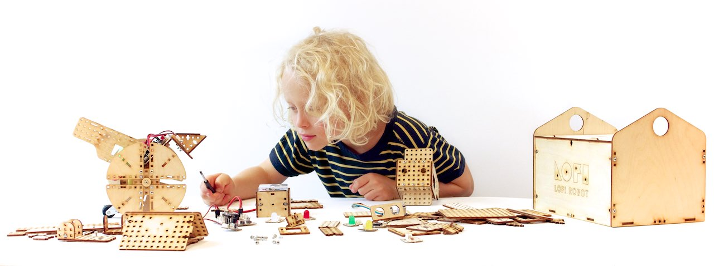
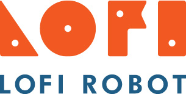

# LOFI Robot - Robotyka w szkole

###Witaj Nauczycielu!

Z wielką radością oddajemy w Twoje ręce pierwszy, polski, interaktywny podręcznik do robotyki! Mamy nadzieję, że będzie on dla Ciebie przydatną pomocą przy realizacji zajęć z podstaw robotyki i programowania.

###Dla kogo przeznaczony jest ten podręcznik?

Opracowane przez nas lekcje przeznaczone są do realizacji w szkole podstawowej w klasach 4-6, jednak z powodzeniem można je wykorzystywać w gimnazjum jak i podczas realizacji zajęć pozaszkolnych.

###Jaki jest cel tego podręcznika?
- w podręczniku znajdziesz podstawowe informację dotyczące rozpoczęcia pracy z zestawem LOFI Robot EDUBOX, dotyczące zarówno konfiguracji sprzętu komputerowego jak i przygotowania zestawu EDUBOX do pracy
- bazę podręcznika stanowią scenariusze pierwszych lekcji jakie możesz zrealizować z wykorzystaniem zestawu LOFI Robot EDUBOX
- w podręczniku zawarliśmy równieź wskazówki dotyczące metodyki prowadzenia zajęć, organizacji pracy uczniów i wprowadzenia elementów grywalizacji, które mamy nadzieję uatrakcyjnią Twoje zajęcia

###Co jest ciekawego w naszym podręczniku:
* znajdziesz tutaj stale rozbudowywaną bazę scenariuszy zajęć obejmujących podstawy robotyki i programowania
* nasze zajęcia dostosowane są do realizacji w ramach regularnych szkolnych lekcji
* będzie nam miło jeśli będziesz współtworzył ten podręcznik razem z nami, do każdego z artykułów możesz dodać swoje komentarze, wszelkie uwagi są dla nas bardzo cenne
* nasz podręcznik w pełnej wersji funkcjonuje w postaci cyfrowej, dzięki czemu możemy rozbudowywać o wszelkiego rodzaju multimedia, filmy video i przykładowe skrytpy do programowania Arduino, które możesz wgrywać bez pomocy zewnętrznego oprogramowania
* jeśli podtrzebujesz możesz pobrać również ten podręcznik jako PDF lub plik do czytnika ebooków (epub, mobi)

###Masz pytania lub uwagi?
Koniecznie daj nam znać!
- Mailowo: **HALO@LOFIROBOT.COM**
- Telefonicznie: **519 568 883**

###SuperKoderzy

Część scenariuszy zajęć znajdujących się w tym podręczniku została opracowana na potrzeby projektu [SuperKoderzy](www.superkoderzy.pl) realizowanego przez [Fundację Orange](https://fundacja.orange.pl/). Współautorem scenariuszy zajęć jest Grzegorz Zawistowski.

###Autorzy: 
Maciej Wojnicki 
Grzegorz Zawistowski (scenariusze zajęć)

  

