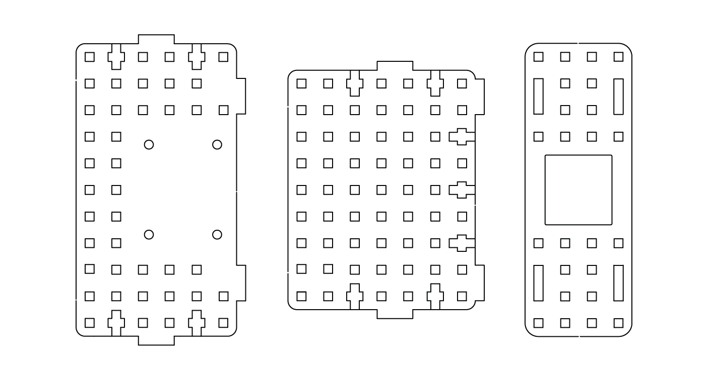
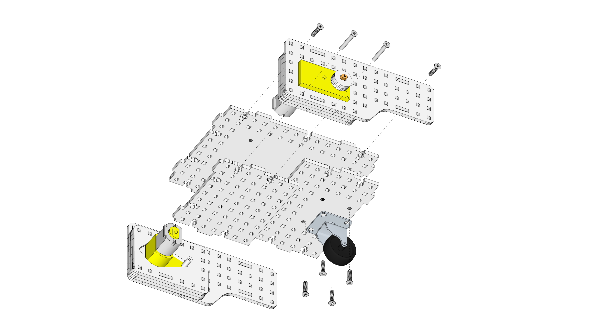
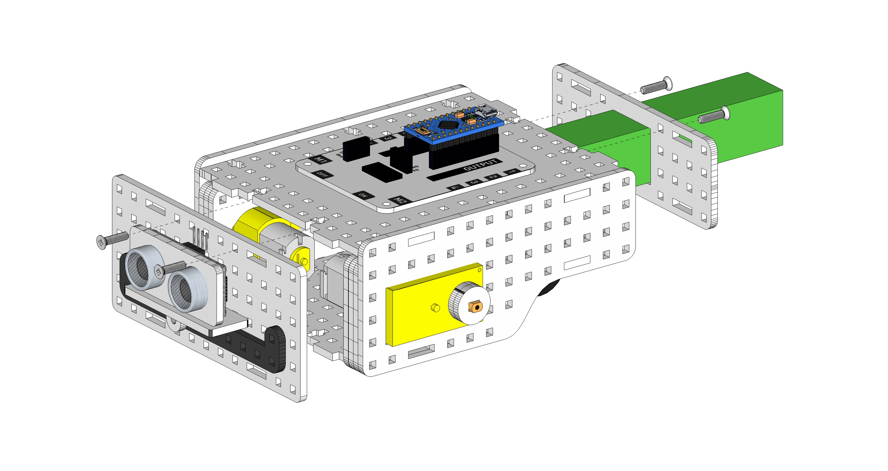
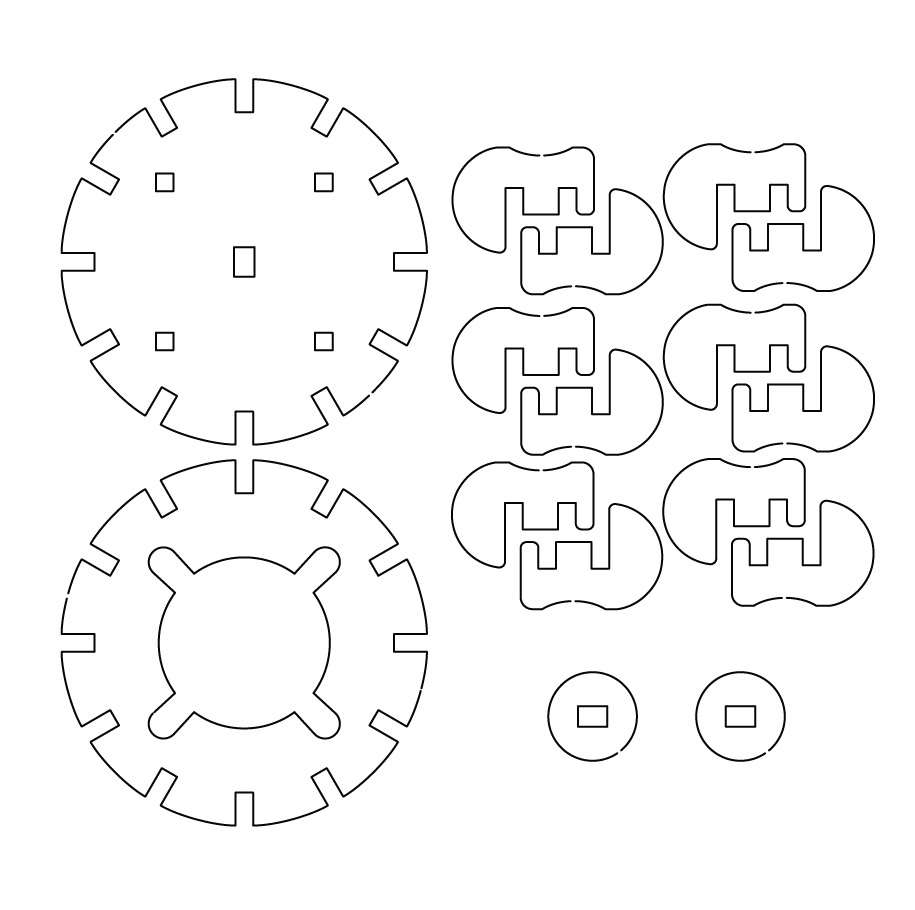
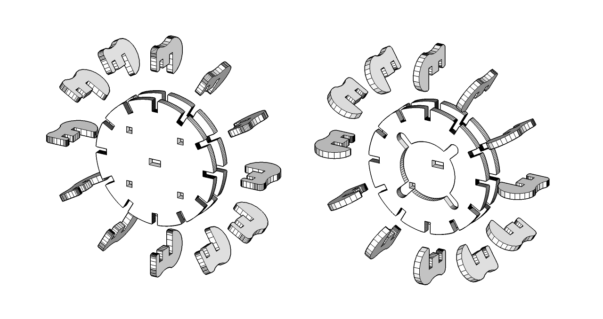
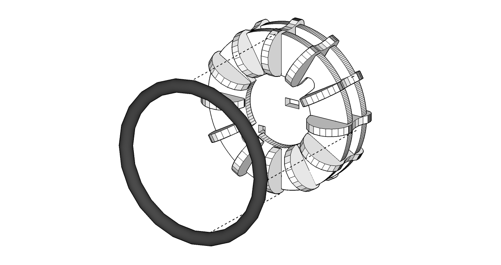
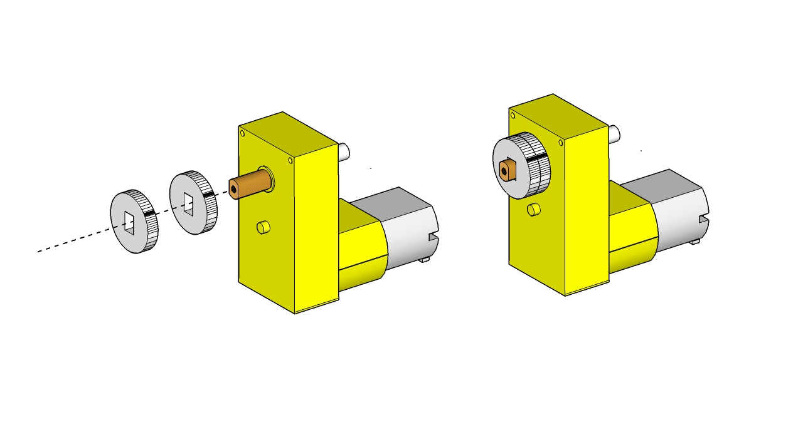
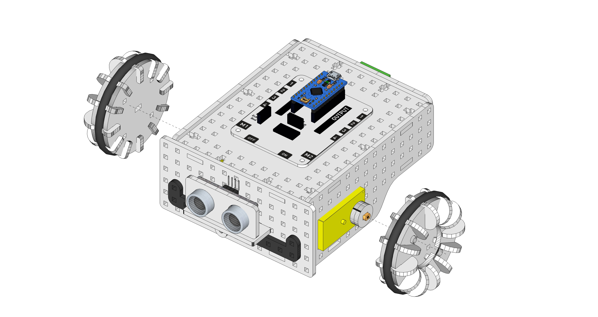

#Lekcja 4: Składamy własnego robota cz. 2.
Czas na realizację zajęć: **45 minut.**

###Wprowadzenie (krótki opis zajęć):
Druga godzina lekcyjna, w trakcie której uczniowie skręcają szkielet robota-pojazdu. 

###Cele zajęć:
Uczeń powinien:
- Korzystać z instrukcji składania.
- Posługiwać się śrubokrętem, śrubkami i nakrętkami przy skręcaniu elementów.
- Skręcać / łączyć samodzielnie poszczególne elementy szkieletu.
- Złożyć cały pojazd.
- Złożyć koła pojazdu.
- Prawidłowo wykonać połączenia elektryczne i elektroniczne w robocie - pojeździe.
         
###Pojęcia kluczowe:
- Sterownik LOFI Brain
- Powerbank
- Elementy konstrukcyjne / szkielet robota
- Śrubka, nakrętka
- Silnik
- Moduły: czujniki odległości 

###Treści programowe (związek z podstawą programową)
Podstawa programowa kształcenia ogólnego dla szkół podstawowych – II etap edukacyjny – klasy IV-VI. Zajęcia komputerowe. Treści szczegółowe:

5. Rozwiązywanie problemów i podejmowanie decyzji z wykorzystaniem komputera.
Uczeń:
	5.2. uczestniczy w pracy zespołowej, porozumiewa się z innymi osobami podczas
	realizacji wspólnego projektu, podejmuje decyzje w zakresie swoich zadań i
	uprawnień.
6. Wykorzystywanie komputera oraz programów i gier edukacyjnych do poszerzania wiedzy
z różnych dziedzin. Uczeń:
	6.1. korzysta z komputera, jego oprogramowania i zasobów elektronicznych (lokalnych
	i w sieci) do wspomagania i wzbogacania realizacji zagadnień z wybranych
	przedmiotów;
	6.2. korzysta z zasobów (słowników, encyklopedii, sieci Internet) i programów
	multimedialnych (w tym programów edukacyjnych) z różnych przedmiotów
	i dziedzin wiedzy.
                   
###Metody pracy:
- Objaśnienie 
- Pokaz
- Ćwiczenia laboratoryjne
- Projekt

###Materiały pomocnicze:
- Zestaw EDUBOX LOFI Robot (Sterownik LOFI Brain z wgranym skryptem robota omijającego przeszkody*, Powerbank, Dwa silniki DC wraz z kołami, Komplet części drewnianych, Czujnik odległości - HC-SR04)
- Skrypt do robota - pojazdu omijającego przeszkody - http://www.lofirobot.com/edubox/robot-omijajacy-przeszkody/ - nauczyciel powinien wgrać na każdy sterownik przed lekcją 4, tak aby po złożeniu i podłączeniu całego robota-pojazdu, dzieci mogły go uruchomić i zobaczyć jego działanie.
- Śrubokręt, śrubki i nakrętki (znajdują się w zestawie EDUBOX LOFI Robot)
- Laptop/komputer nauczycielski, projektor i tablica projekcyjna.
Ewentualnie: wydrukowane schematy / instrukcje składania robota.
 
Zaleca się przeprowadzenie tej lekcji bezpośrednio po lekcji nr 3, co daje łącznie 90 minut.
 
Przebieg zajęć:

1. Wprowadzenie w tematykę i integracja grupy

[do graficzki - na marginesie?] Czas na realizację tej części: ok 5 minut.

Informujemy uczniów, że podczas tych zajęć kończymy składanie naszego robota - pojazdu. Przypominamy, że na poprzedniej lekcji skręciliśmy już: dwa boki, ścianę przednią i górną (ze sterownikiem). Teraz musimy jeszcze zrobić: koła, podwozie, ścianę tylną i wszystko połączyć w jeden zwarty pojazd.

Prosimy o podział na grupy taki, jak na ostatniej lekcji. Rozdajemy grupom ich zestawy.

Uwaga: Przy pierwszym użyciu zestawów EDUBOX (gdy jeszcze koła nie były składane wcześniej) na tej lekcji każda z grup pracująca z jednym zestawem, musi na pół godziny podzielić się jeszcze na dwa mniejsze zespoły. Jeden zespół będzie wykonywał ćwiczenie 1 - skręcanie pojazdu, podczas gdy drugi zespół - ćwiczenie 2 - składanie kół. W przyszłości, gdy nauczyciel będzie miał już złożone koła i będzie realizował ten temat z inną grupą, Ćwiczenie 2 staje się nieaktualne (kół po zakończeniu całego cyklu zajęć nie warto rozmontowywać, a więc z kolejnymi klasami nie trzeba będzie składać). W takiej sytuacji grupy do wykonania będą miały tylko Ćwiczenie 1.
  
##Część zasadnicza
Czas na realizację tej części: **ok. 35 minut **

###Ćwiczenie 1 - dla pierwszego zespołu - skręcamy pojazd (ok. 30 min)

Z dostępnych w zestawie elementów przygotuj: elementy, które przygotowaliśmy na poprzedniej lekcji (2 ściany boczne z silnikami, górną część korpusu ze Sterownikiem LOFI Brain, ścianę przednią z czujnikiem odległości), powerbank, kółko obrotowe, 3 nowe drewniane płytki podwozia (jak na schemacie) oraz 4 długie śrubki, 12 krótkich śrubek i 16 nakrętek. 

Odszukaj i wyłam 3 drewniane elementy konstrukcyjne i wszystko ułóż przed sobą.

Przykręć kółko obrotowe do jednej ze dolnych ścianek pojazdu. Następnie złóż i skręć dolne ścianki z bokami pojazdu i górną ścianką w całość.
Uwaga: Zanim skręcisz boki z górną ścianką, przełóż przez wcięcia w górnej ściance korpusu kabelki od silników. 

Zadanie można podzielić: jeden uczeń szuka i wyłamuje drewniane elementy, drugi szuka i przygotowuje niezbędną ilość śrubek i nakrętek. Następnie jeden przykręca obrotowe kółko do jednej części podwozia, a drugi w tym czasie przykręca boki do drugiej części podwozia. 

*Wskazówka: składając pojazd najpierw warto tylko delikatnie “złapać” śrubkami nakrętki, aby dało się złożyć górę i dół, a dopiero później wszystko mocniej dokręcić. Gdy dokręcisz od razu za mocno dwie dolne płytki do boków, możesz mieć problem z włożeniem na miejsce górnej płytki korpusu.*

Następnie z przodu korpusu zamontuj złożoną wcześniejprzednią ściankę wraz z czujnikiem odległości. Z tyłu umieść POWERBANK i tylną ściankę.

Korpus z przykręconym komputerem (sterownikiem) odłóż na bok - do “magazynu elementów gotowych” i (jeśli zespół drugi jeszcze pracuje) pomóż drugiemu zespołowi w kończeniu kół.

###Ćwiczenie 2 - dla drugiego zespołu - składamy koła (ok. 30 min)

Z dostępnych w zestawie elementów przygotuj (odszukaj i wyłam oraz połóż przed sobą): wszystkie drewniane elementy potrzebne do budowy kół, zgodnie z poniższym schematem (są to: 4 okrągłe obręcze, 2 x 12 = 24 łączniki, 4 okrągłe dystanse z prostokątnym środkiem i 2 małe okrągłe podkładki).

Złóż ramę każdego z kół: każde koło składa się z dwóch obręczy i dwunastu łączników.
Uwaga: elementy są bardzo ściśle dopasowane. Wyłamując z płytek i nakładając łączniki na obręcze uważaj, aby nic nie połamać. Użyj odpowiedniej siły, aby nałożyć łączniki na obręcze, tak aby każda weszła do końca. Należy to robić powoli, po kolei - “łącznik po łączniku”, dokładnie.

Na każde złożone koło naciągnij gumowy oring jako oponę.

Gotowe koła odłóż na bok - do “magazynu elementów gotowych” i (jeśli zespół pierwszy jeszcze pracuje) pomóż pierwszemu zespołowi w kończeniu montowania pojazdu.

Gdy oba zespołu zakończą Ćwiczenie 1 i Ćwiczenie 2: wykonują część wspólną obu ćwiczeń:

Na metalowy trzpień każdego silnika (które mamy już zamontowane w pojeździe) wciśnij po dwa małe dystansowe kółka ze sklejki.
Uwaga: uczniowie mogą mieć problem z założeniem tych dystansów na ośki silników, ponieważ są bardzo mocno spasowane. Nauczyciel może pomóc w założeniu. Trzeba użyć siły, ale z wyczuciem, aby niczego nie połamać, ani nie uszkodzić osi w silnikach.

Następie nałóż koło na metalową oś silnika i zablokuj je, wkręcając w oś śrubkę wraz z drewnianą podkładką dociskającą koło do silnika.

Montaż pojazdu jest zakończony!

###Ćwiczenie 3 - dla całych grup - podłączenie części elektronicznych (ok. 5 min)

Silniki podłącz do gniazd M1 i M2 sterownika LOFI BRAIN.

Czujnik odległości podłącz do odpowiedniego gniazda na sterowniku LOFI BRAIN (znajdującego się powyżej złącza M1, z oznaczeniami: 5V, Echo, Trig, GND) za pomocą kabla 4-żyłowego męsko-żeńskiego.
Uwaga: Zwróć uwagę na odpowiednie podłączenie przewodów do pinów (opisane są zarówno na sterowniku LOFI BRAIN jak i na czujniku odległości): VCC-5V, TRIG-TRIG, ECHO-ECHO, GND-GND.

Powerbank wkładamy z tyłu do pojazdu i podłączamy do dolnego portu miniUSB.

Mówimy uczniom, aby na zakończenie lekcji pojazdy postawili na ziemi i włączyli zasilanie. Informujemy, że wcześniej wgraliśmy skrypt / program, który tak steruje pojazdem, aby odczytywał odległość z przodu i omijał przeszkody.

###Robot omijający przeszkody - skrypt
<iframe src="https://create.arduino.cc/editor/Mananasoko/4528d79d-b5f2-4314-a179-ad6be4f0f6b6/preview?embed" style="height:510px;width:100%;margin:10px 0" frameborder="0"></iframe>

Miłego testowania!

 
###Podsumowanie i ewaluacja
Czas na realizację tej części: **ok. 5 minut**

Zadajemy uczniom pytanie i sprawdzamy: Czy wszystkim grupom udało się dziś:
- Skręcić pojazd?
- Złożyć i założyć koła do pojazdu?
- Prawidłowo wykonać połączenia elektryczne i elektroniczne w robocie?

Pytamy uczniów: 
- Co przysporzyło Wam najwięcej problemów?
- Co dało najwięcej satysfakcji?

Prosimy uczniów o posprzątanie zestawów do pudełek tak, aby nic się nie zgubiło, ani nie pomieszało pomiędzy zestawami różnych grup. 
