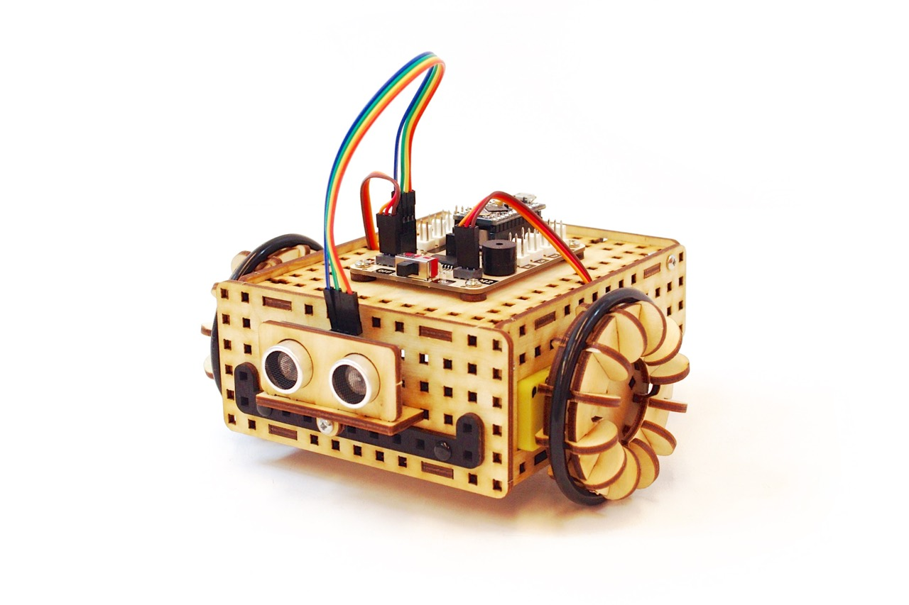
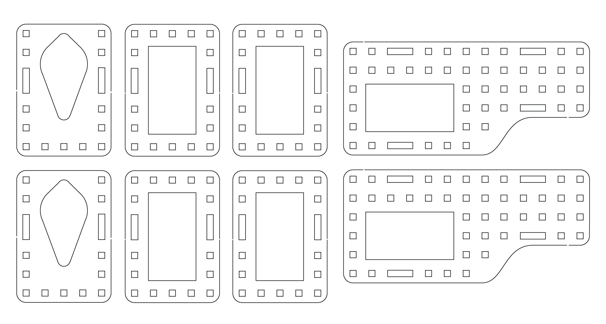
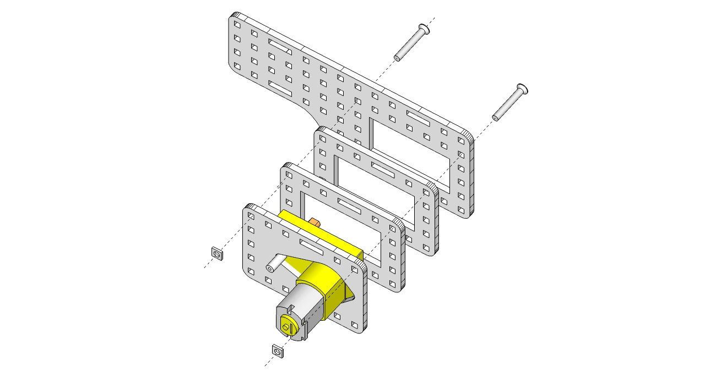
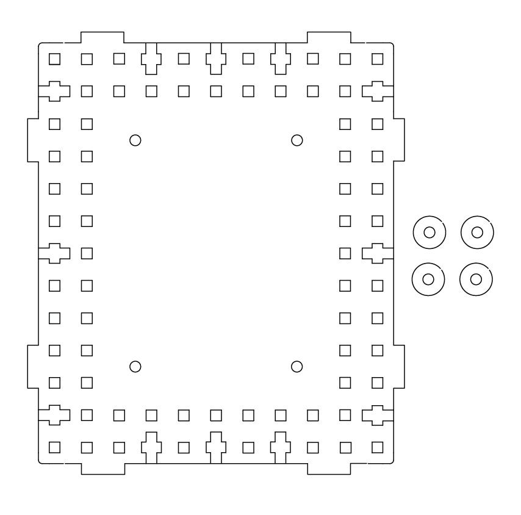
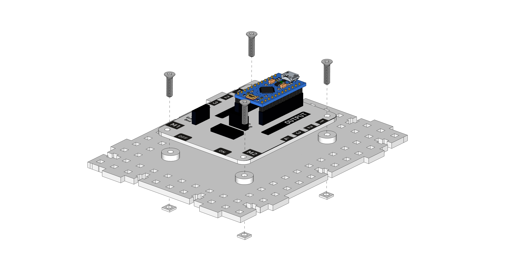
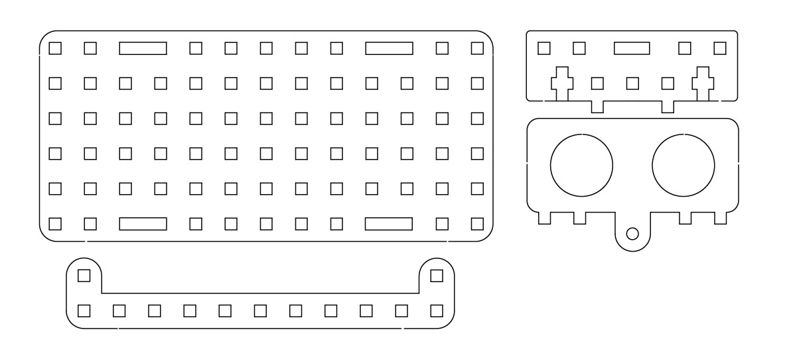
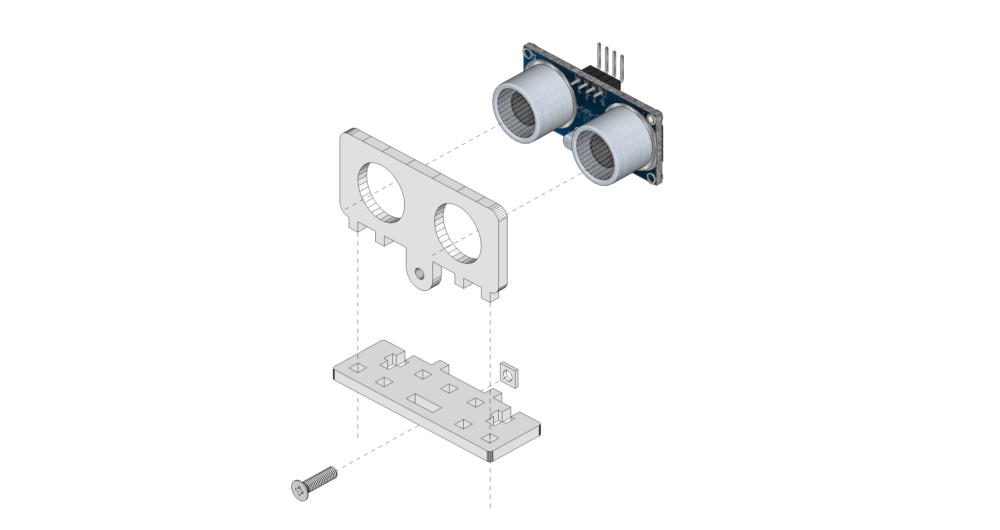
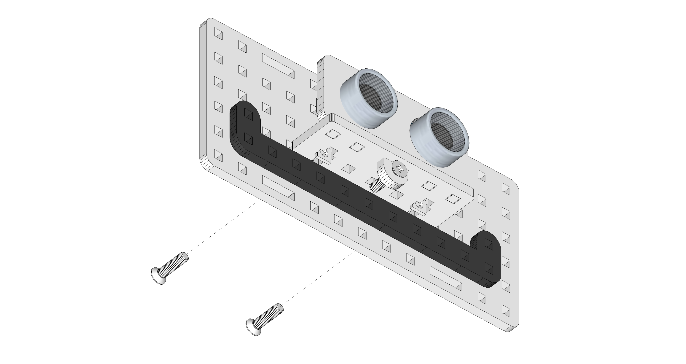

#Lekcja 3: Składamy własnego robota - część 1

Czas na realizację zajęć: **45 minut** 

Zaleca się realizację lekcji 3 i 4 razem, co daje łącznie 90 minut.

###Wprowadzenie (krótki opis zajęć):
Pierwsza z dwóch godzin lekcyjnych, w trakcie której uczniowie skręcają szkielet robota-pojazdu. Zaleca się, aby lekcję 3 i 4 realizować na lekcji łączonej (razem 90 minut).

###Cele zajęć
Uczeń powinien:
- Umieć skorzystać z instrukcji składania.
- Posługiwać się śrubokrętem, śrubkami i nakrętkami przy skręcaniu elementów.
- Skręcać / łączyć samodzielnie poszczególne elementy szkieletu.
- Skręcić boki pojazdu i zamontować w nich silniki.
- Przykręcić sterownik do korpusu.
- Przygotować ścianę frontową pojazdu z czujnikiem odległości.
·     
###Pojęcia kluczowe:
- Sterownik LOFI Brain
- Powerbank
- Elementy konstrukcyjne / szkielet robota
- Śrubka, nakrętka
- Silnik
- Moduły: czujniki odległości 
         
 
###Treści programowe (związek z podstawą programową)
Podstawa programowa kształcenia ogólnego dla szkół podstawowych – II etap edukacyjny – klasy IV-VI. Zajęcia komputerowe. Treści szczegółowe:

5. Rozwiązywanie problemów i podejmowanie decyzji z wykorzystaniem komputera.
Uczeń:
	5.2. uczestniczy w pracy zespołowej, porozumiewa się z innymi osobami podczas
	realizacji wspólnego projektu, podejmuje decyzje w zakresie swoich zadań i
	uprawnień.
6. Wykorzystywanie komputera oraz programów i gier edukacyjnych do poszerzania wiedzy
z różnych dziedzin. Uczeń:
	6.1. korzysta z komputera, jego oprogramowania i zasobów elektronicznych (lokalnych
	i w sieci) do wspomagania i wzbogacania realizacji zagadnień z wybranych
	przedmiotów;
	6.2. korzysta z zasobów (słowników, encyklopedii, sieci Internet) i programów
	multimedialnych (w tym programów edukacyjnych) z różnych przedmiotów
	i dziedzin wiedzy.
          
 
###Metody pracy:
- Objaśnienie 
- Pokaz
- Ćwiczenia laboratoryjne
- Projekt 
          
###Materiały pomocnicze:
- Zestaw EDUBOX LOFI Robot (Sterownik LOFI Brain, Powerbank, Dwa silniki DC wraz z kołami, Komplet części drewnianych, Czujnik odległości - HC-SR04)
- Śrubokręty, śrubki i nakrętki (znajdują się w zestawie EDUBOX LOFI Robot)
- Laptop/komputer nauczycielski, projektor i tablica projekcyjna.
- Ewentualnie: wydrukowane schematy / instrukcje składania robota.
- Aparat fotograficzny, kamera itp. - do przygotowania dokumentacji.
 

 
###Przebieg zajęć:
 
####1. Wprowadzenie w tematykę i integracja grupy

> Uwaga: Warto pamiętać o dokumentacji prowadzonego projektu. Wyznacz ucznia lub sam/sama pamiętaj o zrobieniu filmiku lub kilku zdjęć uczniom składającym roboty.

Informujemy uczniów, że dziś rozpoczniemy składanie własnego pierwszego robota. Będzie to **robot-pojazd**. Zanim będzie mógł się poruszać - jeździć, omijać przeszkody itp. - musimy zbudować jego szkielet. Do tego celu potrzebne będą elementy konstrukcyjne (w przypadku LOFI Robot są to elementy drewniane wycięte ze sklejki oraz śrubki i nakrętki, którymi będziemy łączyć elementy drewniane).

Dzielimy uczniów na grupy (najlepiej 2-3 osobowe; jeśli mamy dużą liczbę uczniów i mało zestawów EDUBOX LOFI Robot, dzielimy uczniów w klasie na tyle grup, ile mamy zestawów). Każdej grupie przydzielamy jeden zestaw EDUBOX. 

*Uwaga: uczniom potrzebna będzie spora przestrzeń do budowy i testowania robota. Typowa ławka szkolna to zwykle zbyt mała powierzchnia - drobne elementy i robot mogą z niej łatwo spaść. Dobrze byłoby złączyć po dwie ławki i uczniów usadzić dookoła.*

Zachęcamy uczniów do otwarcia pudełek (odkręcenie śrubek), wyjęcia podzespołów i rozłożenia na ławkach w taki sposób, aby był dobry dostęp do różnych elementów konstrukcyjnych, kabli i modułów. Do złożenia robota-pojazdu potrzebne będą:
- Sterownik LOFI Brain
- Powerbank
- Dwa silniki DC wraz z kołami
- Komplet części drewnianych, które będziemy wyłamywać z tabliczek
- Czujnik odległości - HC-SR04
 
###Część zasadnicza
Czas na realizację tej części: **ok 30 minut. **

####Ćwiczenie 1 - skręcamy boki pojazdu i montujemy silniki (ok. 15 min)

Z dostępnych drewnianych elementów szkieletu odnajdź i wyłam z tabliczki (szkielety otaczające tabliczki mogą się połamać; uważaj tylko, aby nie uszkodzić naszych docelowych elementów) i ułóź przed sobą 8 elementów (po 2 takie same elementy - tak jak na poniższym schemacie), 2 silniki oraz 4 dłuższe śrubki i 4 nakrętki.

*Uwaga: w zestawie znajdują się śrubki o dwóch dlugościach. W tym kroku używamy tych dłuższych. Natomiast wszystkie nakrętki są takie same.*

Wszystkie niezbędne w tym ćwiczeniu drewniane elementy konstrukcyjne i połóż przed sobą.

Złóż bok i zamocuj silnik dokładnie tak, jak pokazano na schemacie poniżej. Całość skręć przy pomocy śrubokręta. 

Uwaga: najpierw ostrożnie przeciągnij kabel silnika. Drewniane elementy są dość ściśle spasowane z silnikiem. Musisz być precyzyjny i użyć odpowiedniej siły. Nie ściskaj jednak na siłę, za mocno, aby nie połamać klocków.
Następnie złóż mocowanie drugiego silnika. Pamiętaj jednak, żeby drugi silnik zmontować w lustrzanym odbiciu!

Skręcone silniki odłóż na bok na ławce - do “magazynu elementów gotowych”. 

####Ćwiczenie 2 - przykręcamy sterownik do korpusu (ok. 5 min)

Z dostępnych w zestawie elementów przygotuj: największy element drewniany (będzie on stanowił górną ściankę korpusu robota) 4 drewniane okrągłe podkładki, Sterownik LOFI BRAIN oraz po 4 krótsze śrubki i nakrętki. Wyłam wszystkie niezbędne w tym ćwiczeniu drewniane elementy konstrukcyjne i połóż przed sobą.

Pomiędzy drewniany korpus a sterownik LOFI BRAIN podłóż 4 drewniane podkładki. Do korpusu przykręć na środku (tak jak na schemacie poniżej) sterownik LOFI BRAIN przy pomocy 4 śrubek (pamiętaj aby każda śrubka przechodziła przez: sterownik, podkładkę i korpus).

Uwagi: Strona po której znajdują się gniazda USB stanowić będzie tył pojazdu.

Korpus z przykręconym “mózgiem” (sterownikiem) odłuż na bok - do “magazynu elementów gotowych”. 

####Ćwiczenie 3 - budujemy przód naszego pojazdu (ok. 10 min)

Z dostępnych w zestawie elementów przygotuj: czujnik odległości, 4 drewniane elementy ze schematu poniżej oraz 5 krótkich śrubkek i nakrętek. Wyłam drewniane elementy konstrukcyjne i ułóż przed sobą.

Zmontuj uchwyt do czujnika odległości HC-06 zgodnie ze schematem poniżej:

> Uwaga: Drewniane elementy są dość ściśle spasowane z czujnikiem. Musisz być precyzyjny, nie wciskaj nic na siłę, np. pod skosem, aby nie uszkodzić elektronicznych elementów. 

Wskazówka: wkręcając śrubkę, najpierw podłóż nakrętkę, dopiero później do otworu włóż śrubkę i dokręć mocno śrubokrętem, aż nakrętka zostanie dociągnięta do sklejki.

Następnie, zgodnie z poniższym schematem, przymocuj “uśmiech” i czujnik odległości do przedniej ścianki pojazdu:

 

###Podsumowanie i ewaluacja
Czas na realizację tej części: **ok 5 minut.**

Zadajemy uczniom pytanie i sprawdzamy: Czy wszystkim grupom udało się dziś:
- Skręcić oba boki pojazdu z silnikami?
- Przykręcić sterownik do korpusu?
- Przygotować ścianę frontową pojazdu z czujnikiem odległości?

Pytamy uczniów: 
- Co przysporzyło Wam najwięcej problemów?
- Co dało najwięcej satysfakcji?

Prosimy uczniów o posprzątanie zestawów do pudełek tak, aby nic się nie zgubiło. Zalecamy podpisanie każdego zestawu, aby było wiadomo, kto jest za niego odpowiedzialny. 
Zalecamy, aby bezpośrednio po lekcji nr 3 realizować lekcję nr 4.
