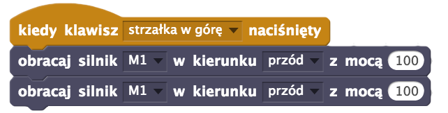

#Lekcja 6: Sterowanie pojazdem przy pomocy klawiatury.

Czas na realizację zajęć: **45 minut (1 godzina lekcyjna)**

[GOTOWY PROGRAM - SCRATCHX (CHROME)](http://www.lofirobot.com/scratchx/?url=http://lofirobot.com/scratchx/examples/klawiatura.sbx#scratch)

https://www.youtube.com/watch?v=Yi9svSC2bAk 
  
###Wprowadzenie (krótki opis zajęć):
Ułożenie w Scratchu instrukcji sterujących zbudowanym robotem-pojazdem przy pomocy strzałek klawiatury. Wyjaśnienie działania bloków “kapeluszowych” - na przykładzie bloku wykrywającego naciśnięcie klawisza. Na koniec zajęć, jeśli wystarczy czasu, atrakcyjne zadanie - wyścigi robotów, rozegranie meczu w piłkę lub przejechanie toru przeszkód.
  
###Cele zajęć
Uczeń powinien:
- Rozumieć pojęcia: funkcja, parametr, zmienna, sterowanie, programowanie.
- Podłączyć / sparować sterownik LOFI Brain z komputerem za pomocą BLUETOOTH.
- Uruchamiać Scratcha on-line.
- Tworzyć skrypty umożliwiające sterowanie pojazdem-robotem przy pomocy klawiatury.
- Sterować robotem przy pomocy klawiatury, dzięki skryptom w programie Scratch.

###Pojęcia kluczowe:
- Scratch
- Sterowanie
- Programowanie
- Pojazd zdalnie sterowany

###Treści programowe (związek z podstawą programową)
Podstawa programowa kształcenia ogólnego dla szkół podstawowych – II etap edukacyjny – klasy IV-VI. Zajęcia komputerowe. Treści szczegółowe:
1.Bezpieczne posługiwanie się komputerem i jego oprogramowaniem. Uczeń:
1.5. posługuje się podstawowym słownictwem informatycznym;
5. Rozwiązywanie problemów i podejmowanie decyzji z wykorzystaniem komputera.
Uczeń:
	5.1. za pomocą ciągu poleceń tworzy proste motywy lub steruje obiektem na ekranie;
	5.2. uczestniczy w pracy zespołowej, porozumiewa się z innymi osobami podczas
realizacji wspólnego projektu, podejmuje decyzje w zakresie swoich zadań i
uprawnień.

###Metody pracy:
- Wykład problemowy
- Pokaz
- Ćwiczenia przedmiotowe
- Projekt

###Materiały pomocnicze:
- Laptop/komputer nauczycielski z zainstalowaną przeglądarką internetową Chrome i wtyczką LOFI Robot ScratchX Chrome. 
Projektor i ekran projekcyjny.
- Komputery uczniowskie z zainstalowanymi przeglądarkami internetowowymi Chrome  i wtyczką LOFI Robot ScratchX Chrome. 
- Dostęp do internetu na wszystkich komputerach.
- Zestaw EDUBOX LOFI Robot - pojazd zmontowany w czasie lekcji 4 z modułem BLUETOOTH, z wgranym wcześniej Lofi FIRMATA do komunikacji przez BLUETOOTH. Instrukcja, jak wgrać Lofi FIRMATA na sterownik LOFI BRAIN do komunikacji BLUETOOTH oraz jak zainstalować wtyczkę do Chrome dostępne są na stronie  - http://www.lofirobot.com/edubox/scratchx-chrome/

#Przebieg zajęć:
 
###1. Wprowadzenie w tematykę i integracja grupy              

Czas na realizację tej części: **ok 5 minut**

Podczas dzisiejszej lekcji zaprogramujemy w Scratchu nasze roboty-pojazdy w taki sposób, aby można było nimi sterować przy pomocy strzałek klawiatury. Będziemy programować, czyli łączyć gotowe bloki w grupy tak, aby powstały gotowe instrukcje sterujące.

Prosimy aby uczniowie podzielili się na grupy, rozdajemy zestawy robotów, prosimy o włączenie komputerów, włączenie robotów, sparowanie ich przez **BLUETOOTH** z komputerami (hasło parowania: 1234), a następnie uruchomienie aplikacji Lofi Robot ScratchX, połączenie robotów z aplikacją i włączenie Scratcha. 

> Uwaga: przed programowaniem robota należy umieścić na jakiejś podstawce, aby podczas testów koła mogły kręcić się swobodnie nie dotykając ławki, ale robot nie mógł jeździć i aby nie spadł z ławki!

 
 
###2. Część zasadnicza
[na marginesie] Czas na realizację tej części: ok 35 minut.

Rozpoczynamy wykład połączony z pokazem, n.t. działania bloków “kapeluszowych” - na przykładzie bloku wykrywającego naciśnięcie klawisza:

Chcąc wykryć naciśnięcie klawisza, używamy bloku **Kiedy klawisz … naciśnięty** z kategorii Zdarzenia. Następnie przypinamy do niego dwa egzemplarze bloku “Obracaj silnik …” uruchamiające odpowiednie silniki/koła podpięte do gniazda **M1** i **M2**.

Ponieważ blok “Kiedy klawisz … naciśnięty” wykrywa tylko moment naciśnięcia klawisza, kiedy go puścimy - silniki nie przestają się kręcić! 

Chcąc je zatrzymać, musimy dodać kolejną akcję. Tworzymy podobny układ bloków jak powyżej, ale tym razem wykrywając naciśnięcie klawisza **SPACJA**, które powoduje ustawienie mocy silników na 0, czyli ich zatrzymanie.

Prosimy uczniów, aby przetestowali powyższe ćwiczenie na swoich komputerach.Następnie polecamy uczniom tak zaprogramować pojazdy, aby można było nimi sterować za pomocą strzałek na klawiaturze. 

Mówimy uczniom, że chcąc dodać ustawianie pozostałych kierunków ruchu (**LEWO, PRAWO, TYŁ**), po prostu powielamy tę samą kombinację bloków, zmieniając wykrywanie klawisza na **STRZAŁKA W LEWO, STRZAŁKA W PRAWO i STRZAŁKA W DÓŁ** oraz odpowiednio ustawiając kierunki obrotów silników. Zalecamy pracę samodzielną uczniów w grupach i testowanie. Pomyłki są dopuszczalne, a nawet mile widziane (uczenie się na własych błędach).

Gdy większość grup osiągnie cel, nauczyciel może na swoim komputerze wykonać i pokazać wszystkim propozycję prawidłowego rozwiązania tego zadania:

W zależności od pomysłów uczniów / problemów jakie zauważą, można rozbudować powyższe funkcje, dodając do każdej z nich polecenie **Czekaj 0.5 sek**, a po nim dodać dwa bloki (dla każdego silnika) **Obracaj silnik …” z mocą 0**. Takie rozbudowanie funkcji, spowoduje, że naciśnięcie którejkolwiek ze strzałek uruchomi pojazdu w określonym kierunku na pół sekundy, po czym pojazd zatrzyma się. Chcąc aby jechał dalej trzeba ponownie naciskać strzałki. Jest to rozwiązanie bezpieczniejsze (robot sam nie odjedzie, nie spadnie z ławki, nie uderzy w ścianę itp.)

###Zabawy z jeżdźącymi robotami

W zależności od czasu, jaki pozostanie do końca lekcji, zalecamy zrealizowanie jednej lub kilku z podanych poniżej propozycji gier:
- **Wyścigi robotów** - wewnątrz klasy wyznaczana jest trasa (np. dookoła ławek), którą muszą przejechać wszystkie roboty. Jeśłi warunki na to pozwalają, to wszystkie roboty mogą startować równocześnie. Jeśli klasa jest mała, roboty pokonują trasę po kolei i mierzony jest czas, w którym każdy z nich dojechał do mety.
- **Mecz w piłkę nożną** - z przodu robota montujemy jakąś formę spychacza, który pozwoli mu zagarnąć i toczyć przed sobą małą piłeczkę (ping-pongową lub kulkę z papieru sklejoną taśmą). Ustalamy zakres boiska i dwie bramki. Mecz ma formułę “każdy na każdego”, czyli każdy zawodnik działa samodzielnie i ma za zadanie wprowadzić piłkę do którejkolwiek z bramek. Wygrywa zawodnik, który zdobędzie najwięcej goli.
- **Walki robotów (SUMO)** -  ustalamy kwadratowy lub okrągły ring o boku/średnicy ok 1m. Zawodnicy walczą parami. Wygrywa ten, który wypchnie przeciwnika z ringu.
- **Tor przeszkód** - określamy trasę, którą ma pokonać każdy robot (np. slalom między pudełkami od zestawów). Roboty startują pojedyńczo. Wygrywa ten, którego czas przejazdu będzie najkrótszy
 
Dziękujemy uczniom za zabawę. Prosimy o posprzątanie torów przeszkód, boisk itp. wyłączenie i zabranie robotów, wyłączenie komputerów. 

###3. Podsumowanie i ewaluacja
Czas na realizację tej części: **ok 5 minut**

###Zadajemy uczniom pytania:
- Co najbardziej podobało się Wam podczas dzisiejszej lekcji?
- Z czym mieliście największe problemy?
- Co można byłby zrobić inaczej?
- Do czego można wykorzystać umiejętności zdobyte na tej lekcji?

