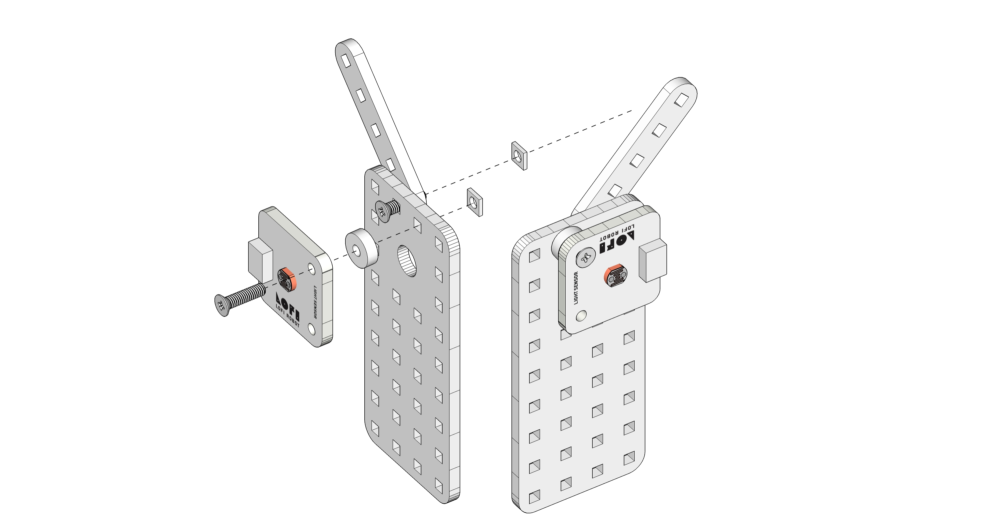
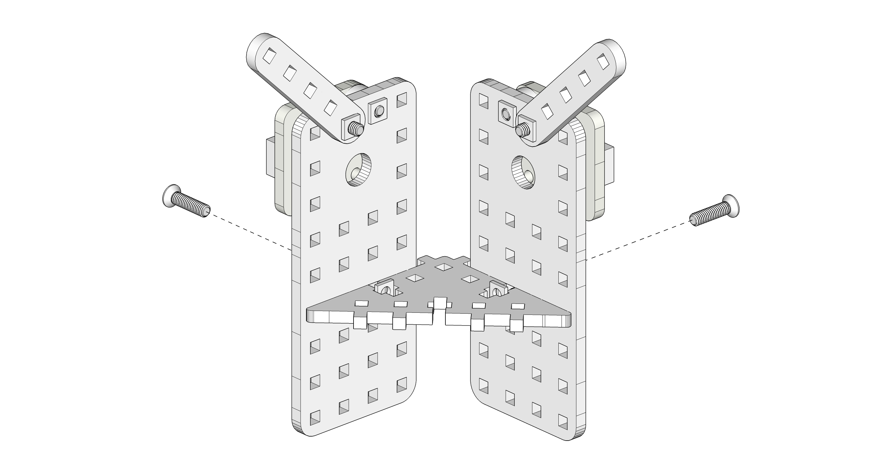
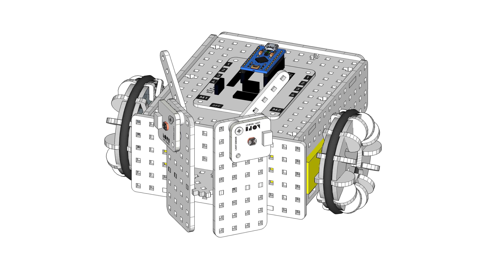

#Mój robot podąża za światłem!
  
Czas na realizację zajęć: **45 minut (1 godzina lekcyjna)**

[GOTOWY PROGRAM - SCRATCHX (CHROME)](http://www.lofirobot.com/scratchx/?url=http://lofirobot.com/scratchx/examples/swiatlolub.sbx#scratch)
  
###Wprowadzenie (krótki opis zajęć):
Rozbudowanie robota poprzez dodanie czujników światła i samodzielne zaprogramowanie w Scratchu autonomicznie działającego robota “światłoluba”. 
 
###Cele zajęć
Uczeń powinien:
- Rozbudować robota o dwa czujniki oświetlenia.
- Rozumieć pojęcia: ciąg poleceń = skrypt = algorytm.
- Podłączyć / sparować sterownik LOFI Brain z komputerem za pomocą BLUETOOTH.
- Uruchamiać Scratcha  
- Zrozumienie algorytmu działania robota - zależności pomiędzy czujnikami odbierającymi światło a ruchem robota
- Sworzyć samodzielnie skrypty w Scratchu pozwalające na autonomiczne działanie robota “światłoluba”
          
###Pojęcia kluczowe:
- Ciąg poleceń / Skrypt / Algorytm
- BLUETOOTH
- Robot autonomiczny - działający samodzielnie (bez sterowania)
- Czujnik natężenia światła
- Programowanie

###Treści programowe (związek z podstawą programową)
Podstawa programowa kształcenia ogólnego dla szkół podstawowych – II etap edukacyjny – klasy IV-VI. Zajęcia komputerowe. Treści szczegółowe:
1.Bezpieczne posługiwanie się komputerem i jego oprogramowaniem. Uczeń:
1.5. posługuje się podstawowym słownictwem informatycznym;
5. Rozwiązywanie problemów i podejmowanie decyzji z wykorzystaniem komputera.
Uczeń:
	5.1. za pomocą ciągu poleceń tworzy proste motywy lub steruje obiektem na ekranie;
	5.2. uczestniczy w pracy zespołowej, porozumiewa się z innymi osobami podczas
realizacji wspólnego projektu, podejmuje decyzje w zakresie swoich zadań i
uprawnień.
 6. Wykorzystywanie komputera oraz programów i gier edukacyjnych do poszerzania wiedzy
z różnych dziedzin. Uczeń:
	6.1. korzysta z komputera, jego oprogramowania i zasobów elektronicznych (lokalnych
	i w sieci) do wspomagania i wzbogacania realizacji zagadnień z wybranych
	przedmiotów;
 
###Metody pracy:
- Wykład problemowy
- Dyskusja dydaktyczna związana z wykładem
- Pokaz
- Ćwiczenia przedmiotowe
- Projekt
        
###Materiały pomocnicze:
- Laptop/komputer nauczycielski z zainstalowaną przeglądarką internetową Chrome i wtyczką LOFI Robot ScratchX Chrome. 
Projektor i ekran projekcyjny.
- Komputery uczniowskie z zainstalowanymi przeglądarkami internetowowymi Chrome  i wtyczką LOFI Robot ScratchX Chrome. 
- Dostęp do internetu na wszystkich komputerach.
- Zestaw EDUBOX LOFI Robot - pojazd zmontowany w czasie lekcji 4 z modułem BLUETOOTH, z wgranym wcześniej Lofi FIRMATA do komunikacji przez BLUETOOTH. Instrukcja, jak wgrać Lofi FIRMATA na sterownik LOFI BRAIN do komunikacji BLUETOOTH oraz jak zainstalować wtyczkę do Chrome dostępne są na stronie  - http://www.lofirobot.com/edubox/scratchx-chrome/
- Dwa czujniki natężenia światła, dodatkowe elementy drewniane ze sklejki oraz śrubki, nakrętki i śrubokręt.
          

#Przebieg zajęć:
 
###1. Wprowadzenie w tematykę i integracja grupy                                                                              
Czas na realizację tej części: **ok. 5-10 minut**	                	                                                    	
Podczas tej lekcji pracować będziemy nad rozbudowaniem naszego robota, dodając mu dwa czujniki światła. Następnie zaprogramujemy go w Scratchu tak, aby działał samodzielnie (bez sterowania przez człowieka), czyli autonomicznie. Robot będzie się nazywał “światłolub” ponieważ będzie podążał za światłem.

Prosimy, aby uczniowie podzielili się na grupy, rozdajemy zestawy robotów, prosimy o włączenie komputerów, włączenie robotów, sparowanie ich przez BLUETOOTH z komputerami (hasło parowania 1234), a następnie uruchomienie aplikacji Lofi Robot ScratchX, połączenie robotów z aplikacją i włączenie Scratcha. 
 
###2. Część zasadnicza
[graficzka - na marginesie?] Czas na realizację tej części: ok. 35 minut.

####Ćwiczenie 1 - montujemy czujniki natężenia światła (ok. 10 min)

Prosimy, aby uczniowie wyjęli z zestawów dwa czujniki natężenia światła i podpięli je pod wejścia INPUT1 i INPUT2.
Wskazówka: warto podłączyć czujnik światła, który zamontowany będzie z prawej strony pojazdu, do INPUT1 (ponieważ prawy silnik podłączony jest do M1), a czujnik z lewej strony pod INPUT2. Pozowoli to bardziej intuicyjnie programować i zachować porządek.

Prosimy, aby uczniowie za pomocą drewnianych elementów ze sklejki oraz śrubek i nakrętek przymocowali oba czujniki do pojazdu.

1. Czujniki światła przykręcamy do prostokątnych klocków 9x4 po stronie, po której znajdują się okrągłe otwory. W pobliżu czujników możemy również przykręcić podłóżne wąskie klocki jako “czółki”, nie pełnią one żadnej funkcji ale robot wygląda z nimi fajniej ;-)

2. Zmontowane elementy z czujnikami łączymy wspólnie przy pomocy trójkątnego klocka tak aby czujniki skierowane były w przeciwnych kierunkach pod kątem 90 stopni.

3. Połączone elementy z czujnikami montujemy na przedniej ściance pojazdu tak, aby czujniki ustawione były jak oczy robota, jedno skierowane w lewo a drugie w prawo.

###Ćwiczenie 2 - programujemy robota “światłoluba” (ok. 10 min)

Opisujemy uczniom, jakie są założenia i jaki ma być schemat działania robota:

- Robot porusza się samodzielnie, jadąc w kierunku źródła światła (np. latarki).
- Dzięki wykorzystaniu dwóch czujników natężenia światła, skierowanych w przeciwne strony, robot jest w stanie ocenić, po której stronie znajduje się źródło światła i odpowiednio skorygować swój tor jazdy.
- LEWY CZUJNIK umieszczony jest po stronie silnika M2, PRAWY CZUJNIK umieszczony jest po stronie silnika M1.
- Jeśli źródło światła znajduje się po lewej stronie robota, więcej światła pada na LEWY CZUJNIK. Wskazówka: robot skręca w lewo gdy PRAWY silnik kręci się szybciej niż lewy.
- Chcąc, aby robot skręcał w kierunku źródła światła, odczyty z LEWEGO CZUJNIKA (INPUT 2) przypisujemy do PRAWEGO KOŁA (M1), a odczyty z PRAWEGO CZUJNIKA (INPUT 1) przypisujemy do LEWEGO KOŁA (M2). Otrzymujemy wówczas schemat ruchu:
źródło światła z LEWEJ STRONY - większą wartość wskazuje LEWY CZUJNIK - PRAWE KOŁO kręci się szybciej, a więc robot skręca w LEWO.
- dla źródła światła po PRAWEJ STRONIE schemat jest odwrotny.

Polecenie: postarajcie się samodzielnie ułożyć ciąg poleceń (czyli algorytm) pozwalający na autonomiczne poruszanie się robota tak, aby podążał za światłem, z wykorzystaniem dwóch czujników natężenia światła.

Uczniowie powinni samodzielnie metodą doświadczalną ułożyć niezbędny algorytm, testując w międzyczasie to, co zrobili i wprowadzając poprawki. Grupy mogą dzielić się doświadczeniami.

> Uwaga: Podczas pracy w grupach uczniów można wykonać kilka zdjęć, nagrać krótkie filmiki - posłużą one do dokumentacji projektu.

Jeżeli którejś z grup nie uda się osiągnąć założonego celu, nauczyciel po jakimś czasie może wyświetlić na tablicy gotowe rozwiązanie i polecić, aby uczniowie porównali je ze swoimi skryptami i poprawili lub odtworzyli patrząc na tablicę.

Przykładowe rozwiązanie - Skrypt Scratch:

Pozostałą częsć lekcji uczniowie powinni poświęcić na testowanie działania robotów i modyfikowanie skryptów / algorytmu.

Na koniec porządkujemy salę, wyłączamy i składamy roboty do skrzyneczek, wyłączamy komputery. 

###3. Podsumowanie i ewaluacja
Czas na realizację tej części: **ok 5 minut**

####Zadajemy uczniom pytania:
- Co najbardziej podobało się Wam podczas dzisiejszej lekcji?
- Z czym mieliście największe problemy?
- Co można byłoby zrobić inaczej?
- Do czego można wykorzystać umiejętności zdobyte na tej lekcji?

