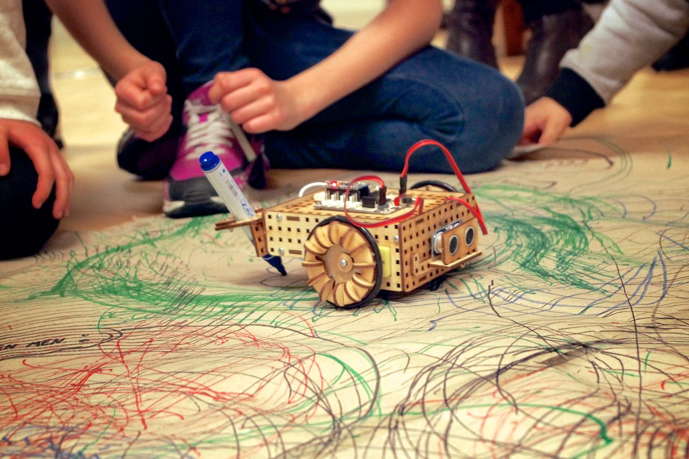
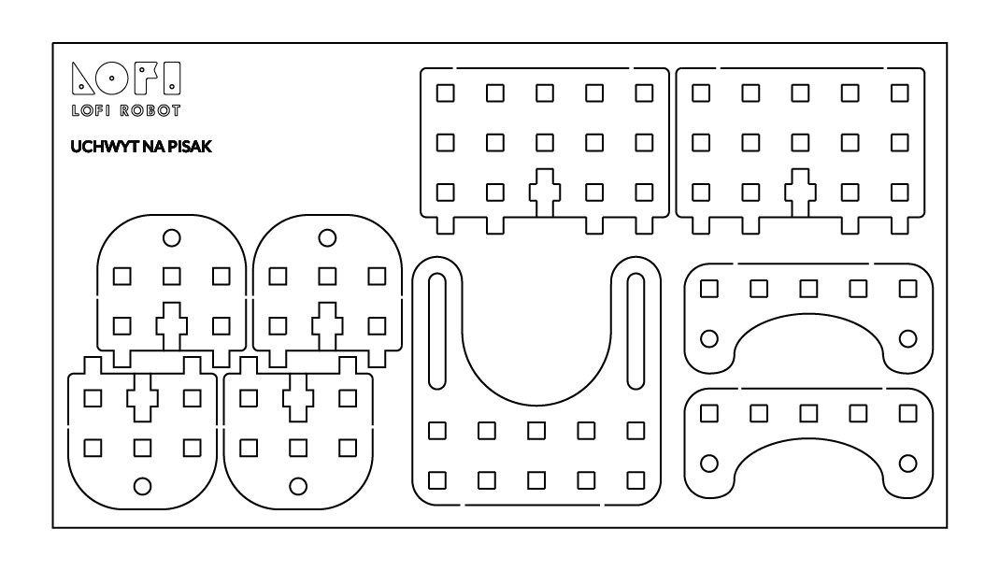
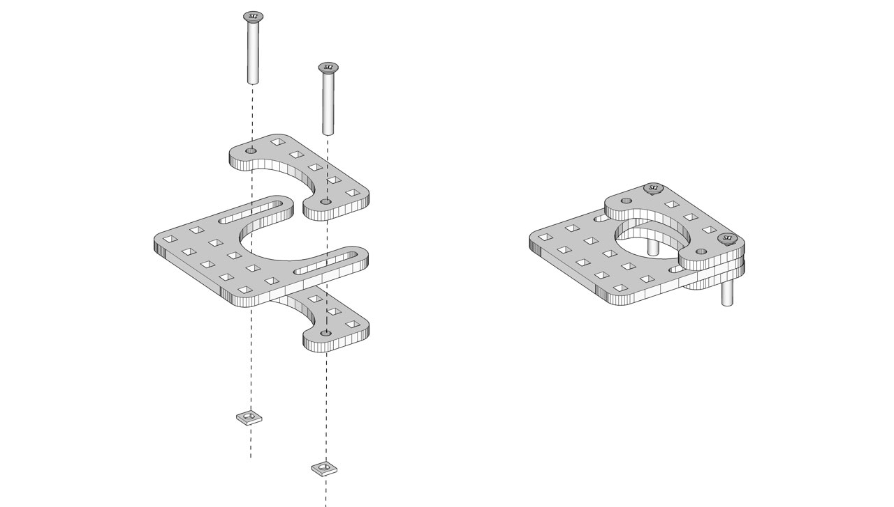
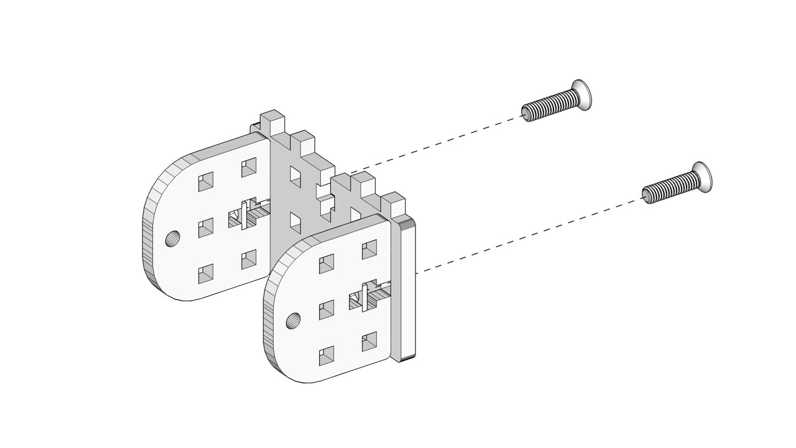
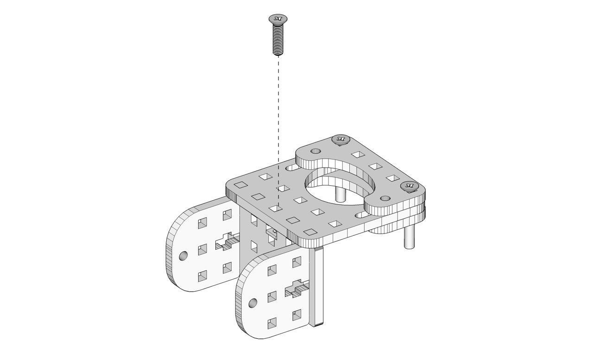
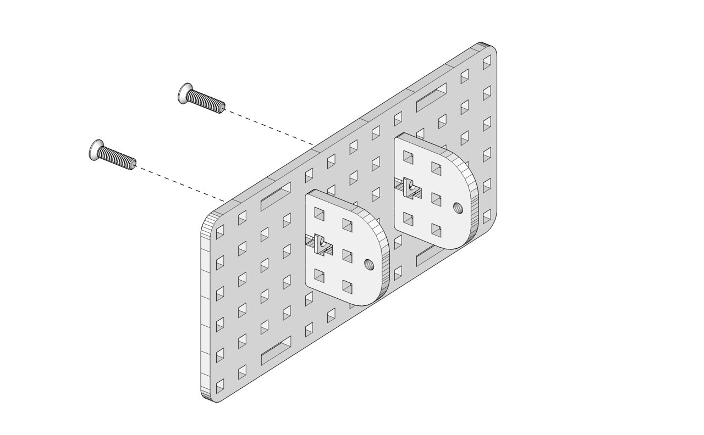
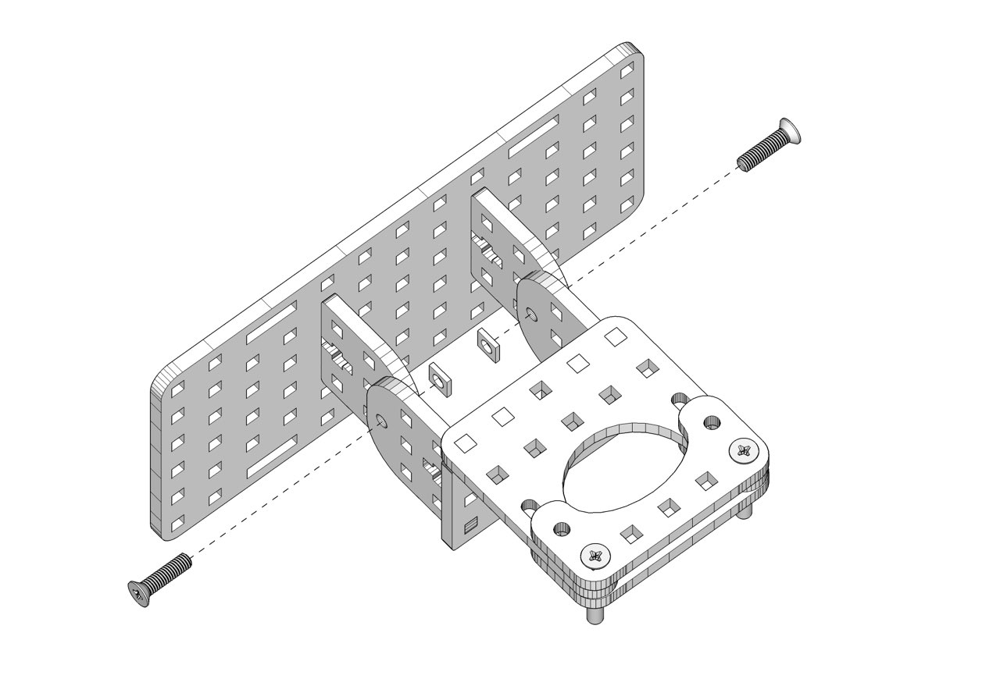
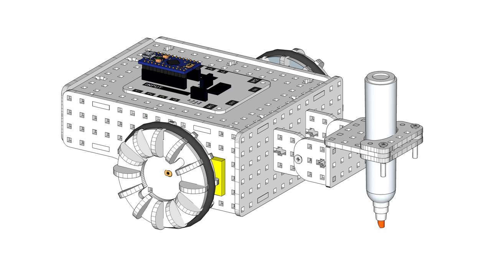

#Mój robot potrafi malować!

Czas na realizację zajęć:** 90 minut (2 godziny lekcyjne) **

###Wprowadzenie (krótki opis zajęć):
Ideą tej lekcji jest pokazanie na praktycznym przykładzie, w jaki sposób z prostych elementów graficznych, powtarzanych wielokrotnie, mogą powstać złożone i rozbudowane rezultaty. Uczniowie najpierw rozbudują pojazd o funkcję uchwytu do mazaka, następnie zaprogramują i rozpoczną testy. Dlatego zalecamy realizowanie tego tematu lekcji w czasie 2 godzin lekcyjnych (90 minut). Na tej lekcji uczniowie przekonają się, że komputer i roboty są świetne w wielokrotnym powtarzaniu zaprogramownych czynności.

 
###Cele zajęć
Uczeń powinien:
- Rozbudować robota o uchwyt na mazak.
- Rozumieć pojęcia: ciąg poleceń / skrypt / algorytm.
- Podłączyć / sparować sterownik LOFI Brain z komputerem za pomocą BLUETOOTH.
- Uruchamiać Scratcha  
- Tworzyć i wykorzystywać zmienną (tu: “prędkość”).
- Wykorzystywać bloki “nadaj komunikat” i “kiedy otrzymam komunikat”.
- Wyorzystywać pętlę “zawsze” i “powtórz … razy”.
- Tworzyć samodzielnie skrypty w Scratchu, dzięki ktorym robot będzie rysował na arkuszu papieru proste figury oraz wzory, składające się z powtarzania prostych elementów.
  
###Pojęcia kluczowe:
- Pętla
- Rekurencja 
- Fraktal
          
###Treści programowe (związek z podstawą programową)
Podstawa programowa kształcenia ogólnego dla szkół podstawowych – II etap edukacyjny – klasy IV-VI. Zajęcia komputerowe. Treści szczegółowe:
1.Bezpieczne posługiwanie się komputerem i jego oprogramowaniem. Uczeń:
1.5. posługuje się podstawowym słownictwem informatycznym;
4. Opracowywanie za pomocą komputera rysunków, motywów, tekstów, animacji,
prezentacji multimedialnych i danych liczbowych. Uczeń:
	4.1. tworzy rysunki i motywy przy użyciu edytora grafiki (posługuje się kształtami,
	barwami, przekształcaniem obrazu, fragmentami innych obrazów);
5. Rozwiązywanie problemów i podejmowanie decyzji z wykorzystaniem komputera.
Uczeń:
	5.1. za pomocą ciągu poleceń tworzy proste motywy lub steruje obiektem na ekranie;
	5.2. uczestniczy w pracy zespołowej, porozumiewa się z innymi osobami podczas
realizacji wspólnego projektu, podejmuje decyzje w zakresie swoich zadań i
uprawnień.
 6. Wykorzystywanie komputera oraz programów i gier edukacyjnych do poszerzania wiedzy
z różnych dziedzin. Uczeń:
	6.1. korzysta z komputera, jego oprogramowania i zasobów elektronicznych (lokalnych
	i w sieci) do wspomagania i wzbogacania realizacji zagadnień z wybranych
	przedmiotów;
        
###Metody pracy:
- Wykład problemowy
- Dyskusja dydaktyczna związana z wykładem
- Pokaz
- Ćwiczenia przedmiotowe
- Projekt
·           
###Materiały pomocnicze:
- Laptop/komputer nauczycielski z zainstalowaną przeglądarką internetową Chrome i wtyczką LOFI Robot ScratchX Chrome. 
- Projektor i ekran projekcyjny.
- Komputery uczniowskie z zainstalowanymi przeglądarkami internetowowymi Chrome  i wtyczką LOFI Robot ScratchX Chrome. 
- Dostęp do internetu na wszystkich komputerach.
- Zestaw EDUBOX LOFI Robot - pojazd zmontowany w czasie lekcji 4 z modułem BLUETOOTH, z wgranym wcześniej Lofi FIRMATA do komunikacji przez BLUETOOTH. Instrukcja, jak wgrać Lofi FIRMATA na sterownik LOFI BRAIN do komunikacji BLUETOOTH oraz jak zainstalować wtyczkę do Chrome dostępne są na stronie  - http://www.lofirobot.com/edubox/scratchx-chrome/
- Dodatkowe elementy drewniane ze sklejki, mazaki, arkusze papieru oraz śrubki, nakrętki i śrubokręt.
- Arkusze papieru (najlepiej większy brystol lub papier pakowny) i flamastry/markery.
         

#Przebieg zajęć:
 
###1. Wprowadzenie w tematykę i integracja grupy    
Czas na realizację tej części: **ok. 5 minut  **                                                                      	                
Dziś ponownie przebudowujemy naszego robota. Dorobimy uchwyt na pisak, a następnie w Scratchu zaprogramujemy rooty malujące. Roboty będą jeździły po arkuszach papieru rozłożonych na podłodze. Wszędzie gdzie robot się ruszy - zostawi po sobie ślad. W ten sposób spróbujemy najpierw narysować proste kształty i figury, a później sprawdzimy, jak w prosty sposób nauczyć robota malowania złożonych i rozbudowanych elementów graficznych.

Prosimy, aby uczniowie podzielili się na grupy, rozdajemy zestawy robotów.
	                                                    	 
###2. Część zasadnicza
Czas na realizację tej części: **ok. 80 minut**

####Ćwiczenie 1 - montaż uchwytu na pisak (ok. 30 min)

Z dostępnych w zestawie EDUBOX sklejek odszukaj i przygotuj 3 nowe elementy (pokazana na schemacie poniżej). 

Następnie przy pomocy 2 długich śrubek i nakrętek skręć klocki, które będą trzymały pisak. 

Następnie, za pomocą 2 krótkich śrubek i nakrętek, połącz dwa półokrągłe drewniane klocki z elementem zakończonym z jednej strony wpustami:

Połącz obydwa wcześniej skręcone elementy ze sobą za pomocą 1 krótkiej śrubki i nakrętki:

Następnie zdemontuj ściankę frontową pojazdu, odkręć od niej “uśmiech” i czujnik odległości. W to miejsce (na środku na ścianie frontowej) przykręć kolejne 2 półokrągłe klocki, przy pomocy 2 krótkich śrubek i nakrętek: 

Następnie połącz uchwyt ze ścianką frontową pojazdu za pomocą 2 krótkich śrubek i nakrętek - tak, aby półokrągłe klocki tworzyły ruchomy zawias. Nie dokręcaj śrubek do końca, ponieważ pisak powinien być ruchomy - musi swobodnie opadać na podłoże.

Na zakończenie rozbudowy pojazdu zamontuj ponownie ściankę frontową z przyczepionym uchwytem z przodu pojazdu. W otworze uchwytu umieść piask i dokręć długie śrubki tak aby pisak był sztywno zamocowany. Robot malujący jest gotowy. 

####Ćwiczenie 2 - programujemy robota rysującego (ok. 30 min)

Prosimy uczniów o włączenie komputerów i robotów, (jeśłi nie było to zrobione wcześniej) sparowanie ich przez BLUETOOTH z komputerami (hasło parowania 1234), a następnie uruchomienie aplikacji LOFI Robot ScratchX, połączenie robotów z aplikacją i włączenie Scratcha. 

Prosimy, aby uczniowie najpierw przygotowali skrypt “awaryjnego zatrzymania robota”: Kiedy klawisz Spacja naciśnięty - obracaj silnik M1 z mocą 0 i obracaj silnik M2 z mocą 0.

Następnie prosimy, aby uczniowie zrobili 4 skrypty - każdy składający się z dwów bloków “Obracaj silnik” - odpowiadające jeździe robota: 
- do przodu - M1 w przód i M2 w przód
- do tyłu - M1 w tył i M2 w tył
- skręt w lewo - M1 w przód i M2 w tył
- skręt w prawo - M1 w tył i M1 w przód

Początkowo ustawiamy wszędzie moc na np. 80. Kliknięcie każdego ze skryptów powoduje odpowiedni ruch robota, a naciśnięcie spacji zatrzyma robota:

Zadajemy uczniom pytanie: **Czy wiecie, w jaki sposób sprytnie / szybko zmieniać prędkość jazdy, aby nie trzeba było zmieniać tego parametru za każdym razem w 8 przed chwilą użytych blokach?**

Prawidłowa odpowiedź: **Powinniśmy zastosować (stworzyć nową) zmienną.**

Z kategorii “Dane”, tworzymy nową zmienną o nazwie “prędkość”. Następnie owalny blok oznaczający prędkość wstawiamy w każdym z 8 bloków obracania silnikami. Przy pomocy polecenia “Ustaw prędkość na ...” możemy w każdej chwili przypisać zmiennej “prędkość” dowolną liczbę i od tej chwili wszystkie silniki będą obracały się z taką prędkością. Jeśli zechcemy zmiany prędkości - wystarczy kolejny raz Ustawić prędkość na inną wartość i od tego momentu wszystkie polecenia dotyczące jazdy robota będą odbywały się z tą prędkością.

Następnie pokazujemy uczniom blok “Kiedy otrzymam …”. Wprowadzenie w tym bloku dowolnego słowa, np. “Przód” i przypięcie tego bloku z góry do wcześniej przygotowanych bloków, spowoduje przypisanie słowa/komunikatu “Przód” z jakąś czynnością robota, w tym przypadku - jazdą do przodu.

Analogicznie dodajemy komunikaty “Kiedy otrzymam …” - tył, lewo, prawo - do wcześniej przygotowanych skryptów.

Następnie pokazujemy uczniom, jak możemy z tego skorzystać. Dzięki blokom “Nadaj ..” możemy szybko odwołać się do wcześniej zdefiniowanej grupy bloków - skryptu. Dzięki temu możemy wielkokrotnie wykorzystywać te same fragmenty kodu, a nasz program będzie prostszy i bardziej przejrzysty:

Zadajemy uczniom polecenia, aby zaprogramowali robota, do rysowania jakieś figury, dzięki zastosowaniu następujących bloków: “kiedy kliknięto zieloną flagę”, “ustaw prędkość na ..”, “zawsze”, “powtórz … razy”, “nadaj …”, “czekaj …”, jak w przykładzie powyżej. Zachęcamy uczniów do testownia, zmiany parametrów, zmiany skryptów.

####Ćwiczenie 3 - pętla i rekurencja (ok. 20 min)

W zależności od czasu, jaki poświęcimy na wcześniejsze zadania i czasu, jaki nam pozostanie, można omówić przy okazji robota malującego:
Prezentacja działania PĘTLI - robot wykonuje sekwencję dwóch kroków np. PRZÓD, LEWO - poprzez powtórzenie 4 razy powstaje kwadrat.
Prezentacja pojęcia REKURENCJI - jeden parametr zwiększa się (lub zmiejsza) za każdym powtórzeniem pętli. Robot rysuje wzór np. w formie powiększającej się spirali - nawiązanie do FRAKTALI. Można omówić powtarzające się wzory i sekwencje w naturze, np. pajęczyna, paproć, nasiona słonecznika.
 
###3. Podsumowanie i ewaluacja
[na margines?] Czas na realizację tej części: ok 5 minut.
 
Prosimy o posprzątanie zestawów i odłożenie części do skrzynek,, wyłączenie komputerów.
Zadajemy uczniom pytania:
Co najbardziej podobało się Wam podczas dzisiejszej lekcji?
Z czym mieliście największe problemy?
Co można byłby zrobić inaczej?
Do czego można wykorzystać umiejętności zdobyte na tej lekcji?

