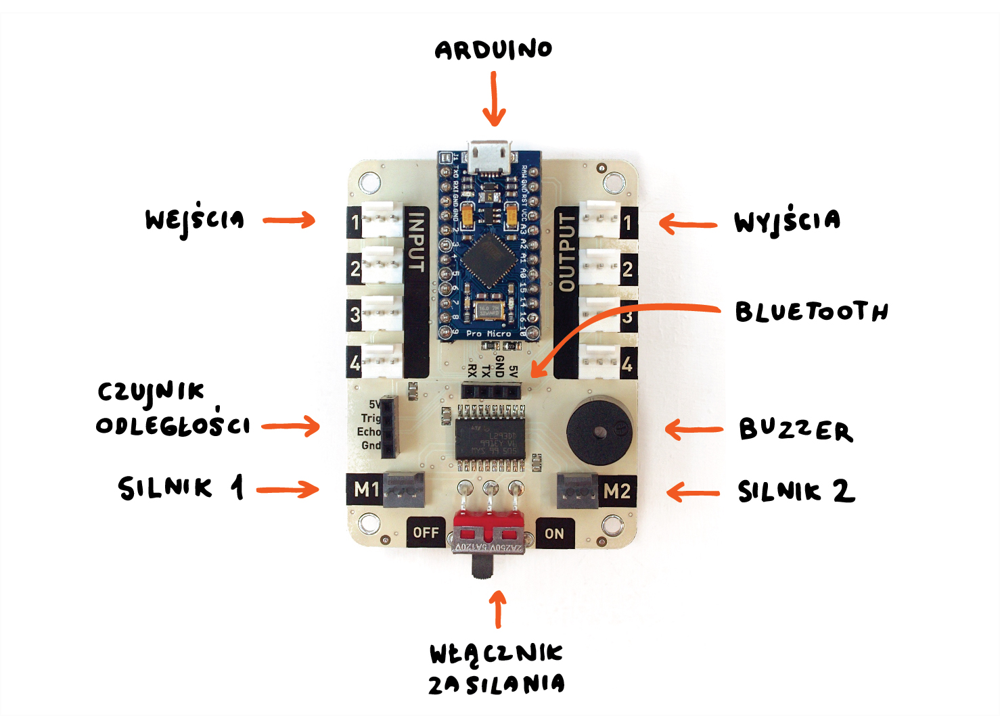
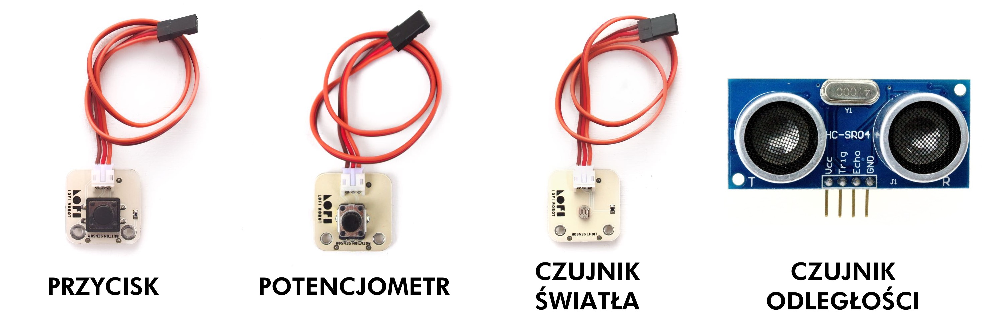
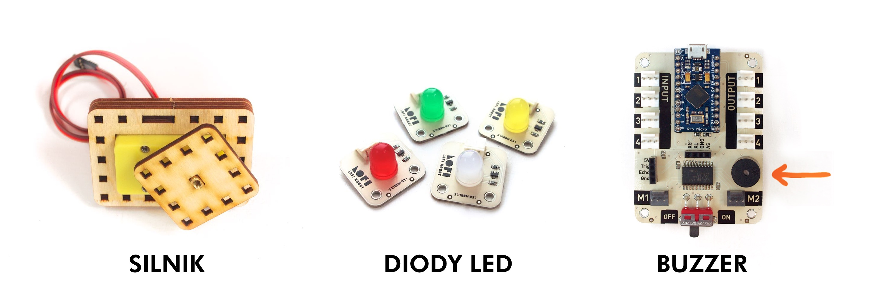
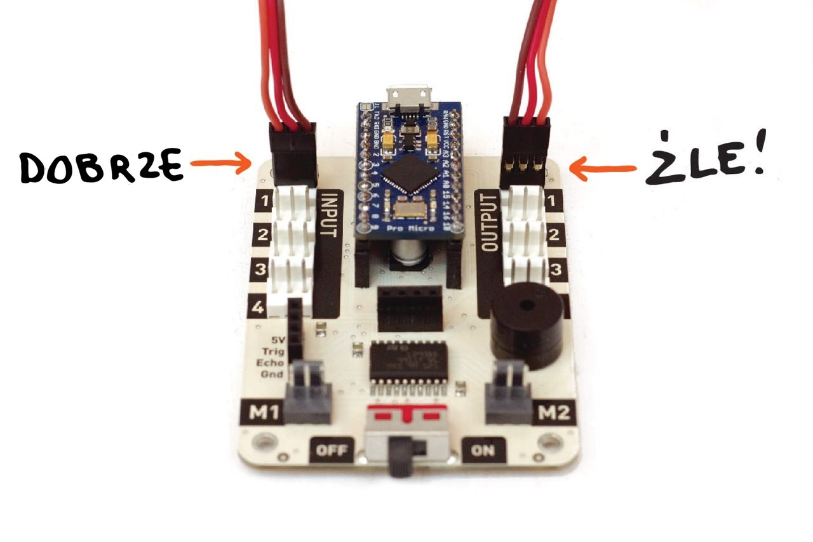
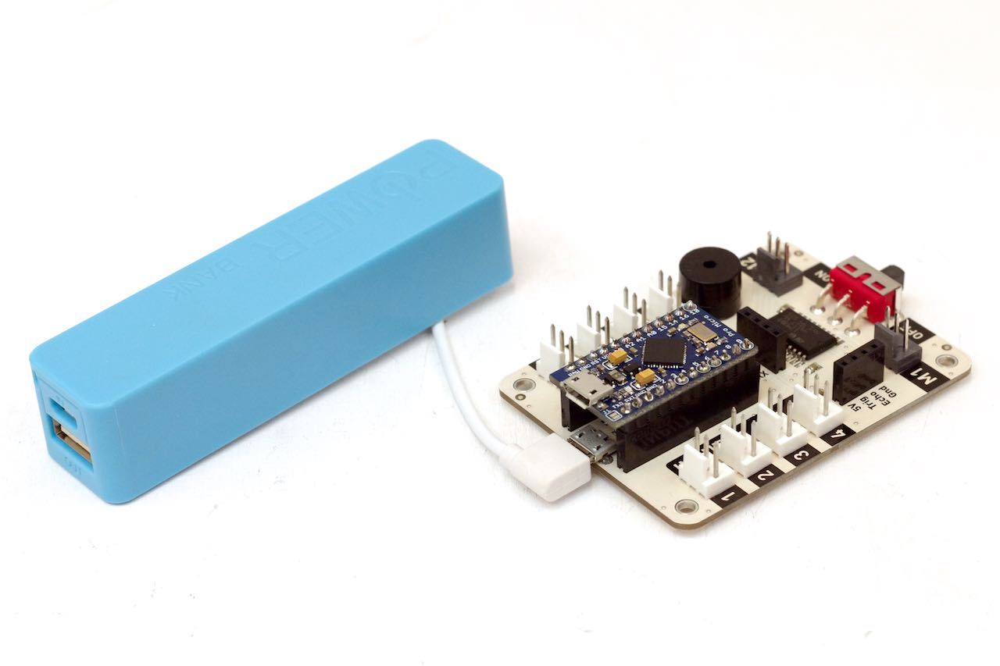
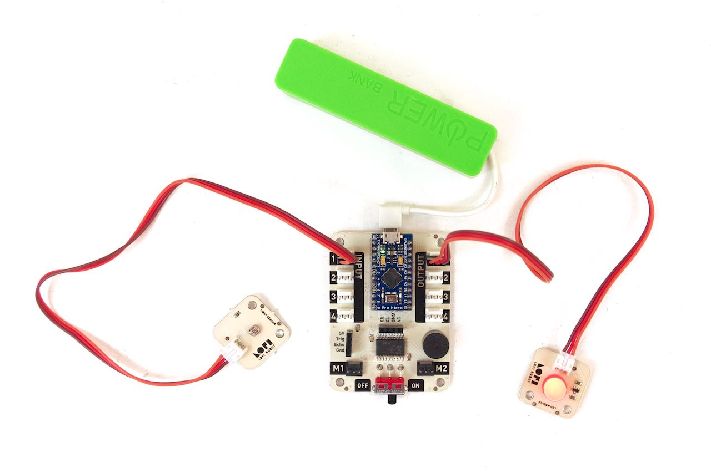
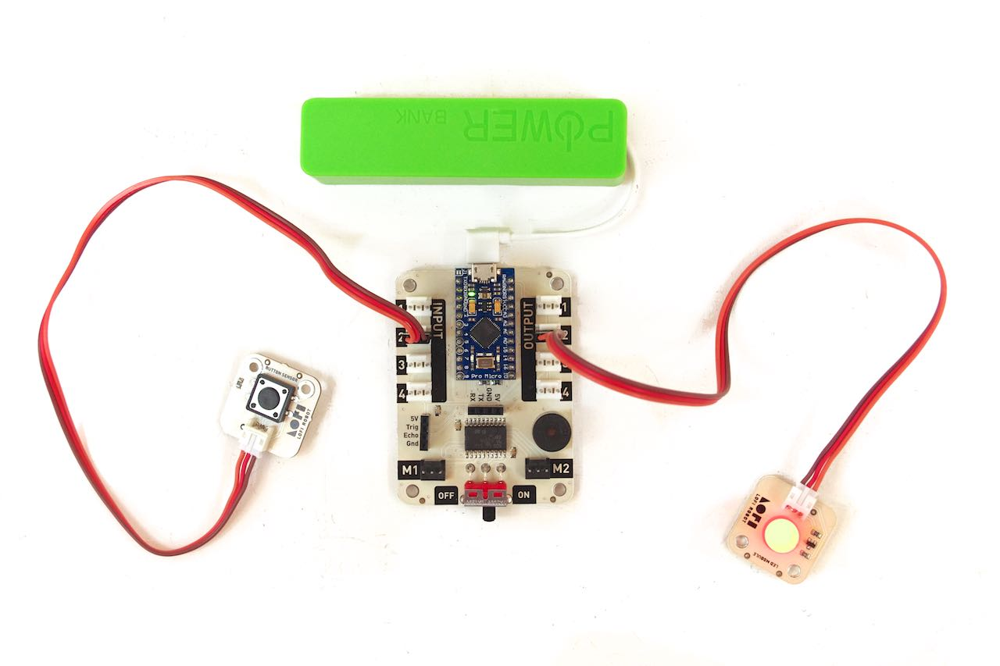
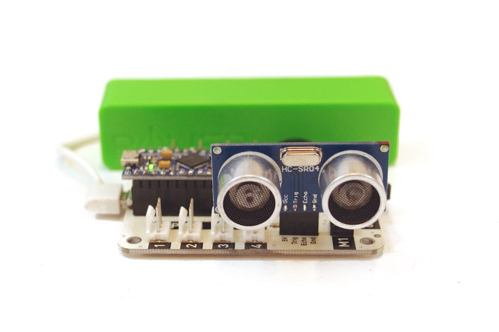
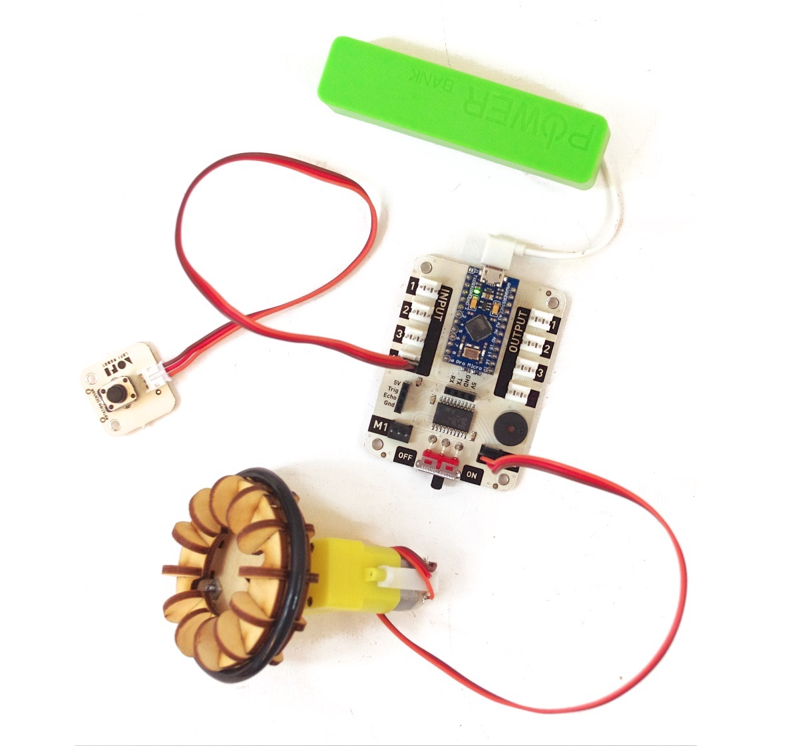

#Lekcja 2: Zmysły robota - poznajemy podstawowe czujniki.
 
Czas na realizację zajęć: **45 minut (1 godzina lekcyjna)**
 
###Wprowadzenie (krótki opis zajęć):
Rozmowa o zmysłach człowieka i czujnikach stosowanych w robotyce. Pokaz działania czujników, jakich będziemy używali podczas budowy robotów. Wprowadzenie w świat robotyki, poprzez zapoznanie z różnymi modułami. 

<iframe style="height: 510px; width: 100%; margin: 10px 0 10px;"
src="https://www.youtube.com/embed/Pvh1p0zXIGo?rel=0" frameborder="0" allowfullscreen></iframe>

###Program do wgrania na Arduino

[LINK DO POBRANIA](https://create.arduino.cc/editor/LoFiRobot/221b6b0a-e584-488f-bac0-9c9ce65c23a4/preview)

<iframe src="https://create.arduino.cc/editor/LoFiRobot/221b6b0a-e584-488f-bac0-9c9ce65c23a4/preview?embed" style="height:510px;width:100%;margin:10px 0" frameborder="0"></iframe>
 
###Cele zajęć
Uczeń powinien:
- Znać pojęcia: robot, modułowość, czujniki i aktuatory.
- Rozumieć i zamiennie stosować pojęcia sterownik / komputer / procesor / mikrokontroler / mózg robota / Sterownik LOFI Brain.
Rozpoznawać i nazywać różne czujniki.
- Opisać możliwości i funkcjonowanie kilku czujników.
- Mieć świadomość, że w elektronice każde medium (światło, dźwięk, ruch) ma postać prądu elektrycznego, który jest głównym nośnikiem informacji.
·           
###Pojęcia kluczowe:
- Robot
- Modułowość
- Czujniki
- Aktuatory 
- Sterownik / Komputer / Procesor / Mikrokontroler / mózg robota / Sterownik LOFI Brain
·          
###Treści programowe (związek z podstawą programową)
Podstawa programowa kształcenia ogólnego dla szkół podstawowych – II etap edukacyjny – klasy IV-VI. Zajęcia komputerowe. Treści szczegółowe:

1) Bezpieczne posługiwanie się komputerem i jego oprogramowaniem. Uczeń:
  1.5. posługuje się podstawowym słownictwem informatycznym;

3) Wyszukiwanie i wykorzystywanie informacji z różnych źródeł. Uczeń:
  3.4. opisuje cechy różnych postaci informacji: tekstowej, graficznej, dźwiękowej, audiowizualnej, multimedialnej.

6) Wykorzystywanie komputera oraz programów i gier edukacyjnych do poszerzania wiedzy
z różnych dziedzin. Uczeń:
	6.1. korzysta z komputera, jego oprogramowania i zasobów elektronicznych (lokalnych
	i w sieci) do wspomagania i wzbogacania realizacji zagadnień z wybranych
	przedmiotów;
	6.2. korzysta z zasobów (słowników, encyklopedii, sieci Internet) i programów
	multimedialnych (w tym programów edukacyjnych) z różnych przedmiotów i dziedzin wiedzy.
·           
###Metody pracy:
- Wykład problemowy
- Pogadanka
- Dyskusja dydaktyczna związana z wykładem
- Pokaz
- Ćwiczenia laboratoryjne
          
 
###Materiały pomocnicze:
Zestaw EDUBOX LOFI Robot (Sterownik LOFI BRAIN z wgranym skryptem do testowania czujników. Moduły: potencjometr, fotorezystor, przycisk, czujnik odległości, dioda LED. Przed lekcją należy naładować powerbanki).
Skrypt do testowania czujników: http://www.lofirobot.com/edubox/testowanie-modulow/  - nauczyciel powinien wgrać skrypt na każdy sterownik przed lekcją 2, aby uczniowie mogli testować moduły.
Śrubokręty, kluczyki, ew. dodatkowe śrubki i nakrętki.
Laptop/komputer nauczycielski, projektor i tablica projekcyjna.
Materiał video: http://www.lofirobot.com/edubox/testowanie-modulow/ (ok 13 min) - do obejrzenia przez nauczyciela przed lekcją.
·           

 

##Przebieg zajęć:

###1. Wprowadzenie w tematykę i integracja grupy                                                                             

Czas na realizację tej części: **ok 10 minut.**	                                                                    

Zadajemy uczniom pytanie: **O czym rozmawialiśmy podczas ostatniej lekcji?**
- Mówiliśmy o tym co to jest robot i maszyna. 
- Dowiedzieliśmy się czym różni się maszyna od robota. 
- Podawaliśmy przykłady maszyn i robotów oraz ich zastosowanie.
- Mówiliśmy o energii, źródłach energii i energii elektrycznej.
- Wiemy, że za pomocą energii elektrycznej można wytworzyć ruch, dźwięk, światło itp.
- Wiemy z czego składa się robot.

Zadajemy uczniom pytanie: **Przypomnijcie, czym różnią się roboty od maszyn?**
- Maszynami sterujemy, a roboty możemy programować.
- Maszyna - wykonuje polecenia natychmiast, nie zapamiętuje ciągu poleceń, podczas gdy robot zapamiętuje ciąg poleceń i wykonuje go po uzyskaniu polecenia rozpoczęcia, ponadto rozpoznaje swoje otoczenie - ma czujnik (zmysły), ma komputer (mózg), dzięki któremu może samodzielnie funkcjonować. 
- Roboty mają komputer / sterownik / mikrokontroler - tak jak człowiek ma mózg.

Zadajemy uczniom pytanie: **Jak prawdziwy mózg może odbierać informacje, analizować je i odpowiednio reagować?**
- To nasze ZMYSŁY - ludzie mają organy, dzięki którym odbieramy informacje: 
  - wzrok - oczy, 
  - słuch - uszy, 
  - dotyk - dłonie, 
  - węch - nos, 
  - smak - język, 
  - zmysł równowagi - błędnik w uchu, 
  - ból - powierzchnia (i wnętrze) całego ciała, 
  - temperatura - powierzchnia ciała.

Zadajemy pytanie: **Jakie zmysły może mieć robot?**
- Podobne do ludzkich: 
  - wzrok - kamera
  - słuch - mikrofon
  - czujniki dotyku/zbliżenia 
  - czujnik dymu/czadu
  - żyroskop 
  - termometr
- Poza podobnymi do ludzkich: 
    - zmysł echolokacji (wykrywania odległości do obiektów znajdujących się w pobliżu), 
    - widzenia w podczerwieni (może “widzieć” temperaturę - przedmiotów jak kamera termowizyjna), 
  - mierzenia siły wiatru, 
  - mierzenia ciśnienia, 
  - mierzenia wilgotności, 
  - pomiar pola magnetycznego, 
  - określanie swojego położenia geograficznego przy pomocy kompasu i dokładnej lokalizacji na kuli ziemskiej przy pomocy GPS.
 

###2. Część zasadnicza

Czas na realizację tej części: **ok 30 minut.**

Wykład i pokaz (na przykładzie zestawu EDUBOX) na temat podstawowych modułów elektronicznych **(10-15 min)**.

Wyjaśniamy uczniom, jaką rolę pełnią w robocie elementy elektroniczne. 
- Robot potrzebuje różnych elementów, aby móc odbierać informacje z zewnętrz (czyli czujniki) oraz elementów, dzięki którym będzie wypływał na otoczenie - wydawał dźwięki, poruszał się, świecił (czylki aktuatorów). Wszystkie te elementy elektroniczne (zarówno czujniki, jak i aktuatory) to kolejne moduły, które podłączamy do sterownika / komputera / mózgu robota. Każdy moduł daje robotowi nowe umiejętności.

Mówimy do uczniów: **Najpierw przyjrzyjmy się ”mózgowi” naszego robota, czyli sterownikowi.** 
- Wyjmujemy sterownik LOFI Brain z pudełka i prosimy uczniów o zrobienie tego samego. Omawiamy podstawowe elementy sterownika:
- PROCESOR - to jego programujemy i to on steruje wszystkimi operacjami - procesor znajduje się na niebieskiej płytce Arduino
- WEJŚĆIA - przy ich pomocy sterownik odbiera sygnały z podłączonych czujników
- WYJŚCIA - przy ich pomocy sterownik steruje podłączonymi modułami
- BUZZER - mały głośniczek, dzięki któremu robot może wydawać proste sygnały dźwiękowe
- DODATKOWE ZŁĄCZA - niektóre moduły elektroniczne potrzebują odpowiedniego podłączenia dlatego mamy dla nich specjalne złącza - do czujnika odległości, modułu bluetooth i silników
- WŁĄCZNIK ZASILANIA - uruchamia sterownik

Mówimy do uczniów: **Teraz przyjrzyjmy się CZUJNIKOM.**
- Wyjmujemy z zestawu EDUBOX poszczególne czujniki, pokazujemy uczniom. Prosimy uczniów (podzielonych na grupy) o odszukanie tych czujników w ich zestawach.
- Mówimy, że czujniki to moduły, dzięki którym robot jest w stanie rozpoznawać otoczenie. 

Czujniki stanowią ZMYSŁY robota:
- Przycisk
- Potencjometr
- Czujnik światła
- Czujnik odległośc
 

*Wskazówka: dobrym sposobem wyjaśnienia zasady działania czujnika odległości jest porównanie go do nietoperza i zjawiska echolokacji.*

Mówimy do uczniów: **Teraz obejrzymy AKTUATORY, czyli moduły, dzięki którym robot może wpływać na otoczenie:**
Następnie wyjmujemy z zestawu EDUBOX aktuatory, pokazujemy uczniom i prosimy ich o odszukanie tych elementów.
- Silnik
- Diody LED
- Buzzer

Mówimy uczniom, że w elektronice każde medium (światło, dźwięk, ruch) ma postać prądu elektrycznego, który jest głównym nośnikiem informacji.

###Pokaz i ćwiczenia laboratoryjne (15-20 min):

####Ćwiczenie nr 1 - Fotorezystor + dioda LED (ok. 5 min):

Czytamy uczniom poniższe polecenia, wykonujemy sami - pokazujemy i prosimy, aby uczniowie zrobili to samo:

*Uwaga: być może nauczyciel będzie musiał pomóc niektórym grupom przy pierwszym podłączaniu i rozłączaniu modułów. Należy zwrócić uczniom uwagę, aby ostrożnie wtykali złączki i aby nie wyrwali kabli wyciągając.
*

Zwróć uwagę na odpowiednie podłączanie wtyczek modułów (czarna wtyczka z jednej strony ma widoczne blaszki, wpinamy ją tak aby blaszki skierowane były w stronę plastikowego bolca gniazda).

Przygotuj 4 elementy: 
- Sterownik LOFI BRAIN (z wgranym wcześniej przez nauczyciela skryptem do testowania czujników)
- Powerbank (wcześniej musi być naładowany)
- Czujnik światła 
- Diodę led

Podłącz powerbank do Sterownika LOFI BRAIN.

Czujnik światła (FOTOREZYSTOR) podłącz do INPUT1.
Diodę LED podłącz do OUTPUT1.
Włącz przełącznik Sterownika LOFI BRAIN.

**Zasada działania:** 
Im więcej światła pada na fotorezystor tym dioda jaśniej świeci. Przysłaniaj więc fotorezystor - dioda będzie świeciła słabiej. Odsłaniaj - dioda będzie świeciła mocniej. Zasłoń dokładnie fotorezystor ręką - dioda zgaśnie. 

Po zakończeniu każdego ćwiczenia: wyłącz zasilanie sterownika, odłącz używane przed chwilą moduły (czujnik i diodę) oraz odłuż na miejsce na biurku, które możemy nazwać “magazynem podzespołów”.

####Ćwiczenie nr 2 - Przycisk + dioda LED (ok. 5 min)

Czytamy uczniom poniższe polecenia, wykonujemy sami - pokazujemy i prosimy, aby uczniowie zrobili to samo:

Potrzebne będą 4 elementy: 
- Sterownik LOFI BRAIN
- Powerbank
- Przycisk 
- Dioda led

Podłącz powerbank do Sterownika LOFI BRAIN.
PRZYCISK podłącz do INPUT2. 
DIODĘ LED podłącz do OUTPUT2
Włącz przełącznik Sterownika LOFI BRAIN.
Naciskaj przycisk, obserwuj co się dzieje z diodą.

Po zakończeniu ćwiczenia: wyłącz zasilanie sterownika, odłącz używane przed chwilą moduły (przycisk i diodę) oraz odłóż na miejsce na biurku do “magazynu podzespołów”.

####Ćwiczenie nr 3 - Czujnik odległości + buzzer (ok. 5 min)

Czytamy uczniom poniższe polecenia, wykonujemy sami - pokazujemy i prosimy, aby uczniowie zrobili to samo:

Potrzebne będą 3 elementy: 
- Sterownik LOFI BRAIN
- Powerbank
- Czujnik odległości

**CZUJNIK ODLEGŁOŚCI** umieść bezpośrednio w przeznaczonym dla niego złączu (opisy na sterowniku pasują do opisów na czujniku).
Włącz Sterownik LOFI BRAIN. Przybliżaj i oddalaj od czujnika odległości otwartą dłoń i słuchaj, jak sygnalizuje to buzzer.

Po zakończeniu ćwiczenia: wyłącz zasilanie sterownika, odłącz używane przed chwilą moduły oraz odłóż na miejsce na biurku do “magazynu podzespołów”.

####Ćwiczenie nr 4 - Potencjometr + silnik (ok. 5 min)

Czytamy uczniom poniższe polecenia, wykonujemy sami - pokazujemy i prosimy, aby uczniowie zrobili to samo:

Potrzebne będzie 4 elementy: 
- Sterownik LOFI BRAIN 
- Powerbank
- Potencjometr
- Silnik (wystarczy sam silnik, jeszcze bez założonego koła)

**POTENCJOMETR** podłącz do **INPUT4**.
**SILNIK** podłącz do złącza **M2**
Włącz Sterownik LOFI BRAIN. Kręć potencjometrem i obserwuj prędkość obrotową silnika.
 

 
W grupach, w których zostanie czas, można poinformować uczniów, że: Skrypt do testowania czujników zakłada, że wejście INPUT1 jest połączone z wyjściem OUTPUT3 z odwróceniem sygnału, tzn. maksymalna wartość (5 volt) na wejściu daje minimalną na wyjściu (0 volt) i na odwrót. Można zachęcić do przetestowania tego przy pomocy poznanych wcześniej czujników i aktuatorów.

Prosimy uczniów o pochowanie wszystkich elementów do pudełek.

###3. Podsumowanie i ewaluacja
Czas na realizację tej części: ok 10 minut.

Zadajemy uczniom pytanie: **Czego nauczyliśmy się podczas dzisiejszej lekcji?**
- Mówiliśmy o tym, czym jest robot, moduł, czujniki i aktuatory.
- Rozmawialiśmy o zmysłach, jakie ma człowiek.
- Poznawaliśmy różne czujniki, jakie możemy podłączyć do robota (w zależności od tego ile czasu na koniec lekcji zostanie - można wymienić dla przypomnienia).
- Poznaliśmy aktuatory, które będziemy podłączać do robota (j.w.).

Zadajemu uczniom pytanie: **Co jest niezbędne, aby informacje z czujników docierały do sterownika robota?** 
Pytania naprowadzające: Co jest głównym nośnikiem informacji? Jest to również potrzebne aby świeciło światło, aby robot poruszał się?

Odpowiedź: **Prąd elektryczny**

